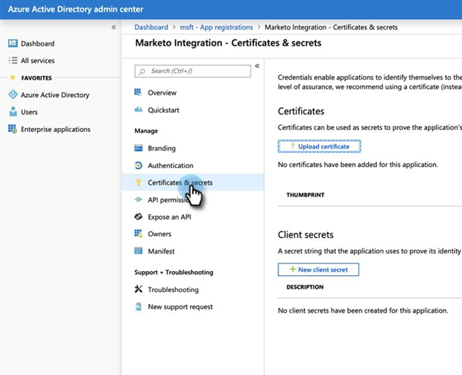
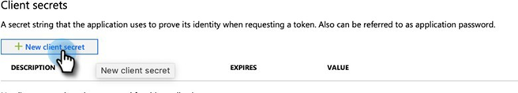
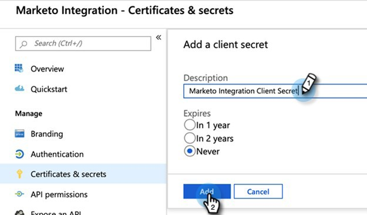
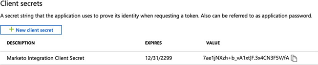
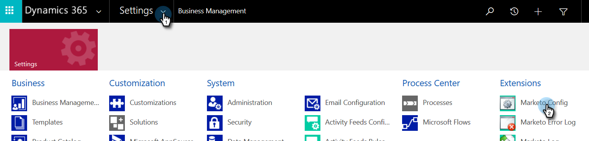
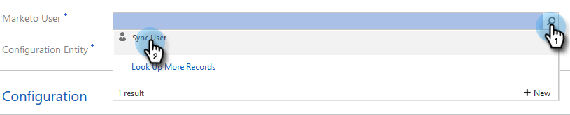
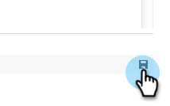
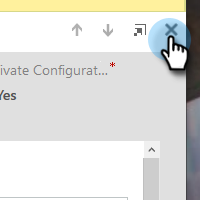
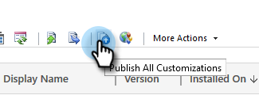

# Passaggio 2 di 3: configurare una soluzione Marketo con connessione server-server {#step-2-of-3-set-up-marketo-sync-user-in-dynamics-s2s}

>[!PREREQUISITES]
>
>[Passaggio 1 di 3: installare la soluzione Marketo con connessione server-server](/help/marketo/product-docs/crm-sync/microsoft-dynamics-sync/sync-setup/microsoft-dynamics-365-with-s2s-connection/step-1-of-3-install.md){target="_blank"}

## Crea applicazione client in [!DNL Azure AD] {#create-client-application-in-azure-ad}

1. Passa a [questo articolo di Microsoft](https://docs.microsoft.com/en-us/powerapps/developer/common-data-service/walkthrough-register-app-azure-active-directory#create-an-application-registration){target="_blank"}.

1. Segui tutti i passaggi. Per il passaggio 3, immettere il nome di un&#39;applicazione pertinente, ad esempio &quot;[!DNL Marketo Integration]&quot;. In Tipi di account supportati, selezionare **Account solo in questa directory organizzativa**.

1. Annotare l&#39;ID applicazione (ClientId) e l&#39;ID tenant. Sarà necessario immetterlo in Marketo in un secondo momento.

1. Concedi il consenso all&#39;amministratore seguendo i passaggi [descritti in questo articolo](/help/marketo/product-docs/crm-sync/microsoft-dynamics-sync/sync-setup/grant-consent-for-client-id-and-app-registration.md){target="_blank"}.

1. Generare un segreto client nell&#39;Admin Center facendo clic su **[!UICONTROL Certificates & secrets]**.

   

1. Fare clic sul pulsante **[!UICONTROL New client secret]**.

   

1. Immettere una descrizione del segreto client e fare clic su **[!UICONTROL Add]**.

   

>[!CAUTION]
>
>Nota il valore Segreto client (visualizzato nella schermata seguente), in quanto viene visualizzato una sola volta e non può essere recuperato di nuovo.

## Creazione di un utente dell’applicazione in Microsoft {#create-application-user-in-microsoft}

1. Segui i passaggi del seguente collegamento per [configurare un utente dell&#39;applicazione in Microsoft](https://docs.microsoft.com/en-us/powerapps/developer/common-data-service/use-single-tenant-server-server-authentication#application-user-creation){target="_blank"}.

   >[!IMPORTANT]
   >
   >* Assegnare le autorizzazioni all&#39;utente dell&#39;applicazione a &quot;Marketo Sync User Role&quot; (Ruolo utente di sincronizzazione).
   >* Prendere nota dell&#39;indirizzo di posta elettronica dell&#39;utente dell&#39;applicazione dall&#39;opzione [visualizza dettagli](https://docs.microsoft.com/en-us/power-platform/admin/manage-application-users#view-or-edit-the-details-of-an-application-user) in Power Platform. Questo indirizzo e-mail verrà utilizzato come nome utente durante la configurazione della connessione a MS [!DNL Dynamics] in Marketo.

## [!DNL Azure AD] federato con [!DNL AD FS On-prem] {#azure-ad-federated-with-ad-fs-on-prem}

Per il Federated [!DNL Azure AD] in [!DNL ADFS Onprem] è necessaria la creazione di un criterio di individuazione del realm home per l&#39;applicazione specifica. Con questo criterio, [!DNL Azure AD] reindirizzerà la richiesta di autenticazione al servizio federativo. La sincronizzazione hash password deve essere abilitata in [!DNL AD Connect] per questo. Per ulteriori informazioni, vedere [[!DNL OAuth] with [!DNL ROPC]](https://docs.microsoft.com/en-us/azure/active-directory/develop/v2-oauth-ropc) e [Set an hrd policy for an application](https://docs.microsoft.com/en-us/azure/active-directory/manage-apps/configure-authentication-for-federated-users-portal#example-set-an-hrd-policy-for-an-application).

Ulteriori riferimenti [sono disponibili qui](https://docs.microsoft.com/en-us/azure/active-directory/reports-monitoring/concept-all-sign-ins#:~:text=Interactive%20user%20sign%2Dins%20are,as%20the%20Microsoft%20Authenticator%20app.&text=This%20report%20also%20includes%20federated,are%20federated%20to%20Azure%20AD.){target="_blank"}.

## Configurare la soluzione Marketo {#configure-marketo-solution}

Un ultimo passaggio: informare la soluzione Marketo del nuovo utente creato.

1. Torna alla sezione [!UICONTROL Advanced Settings] e fai clic sull&#39;icona  accanto a [!UICONTROL Settings], quindi seleziona **[!UICONTROL Marketo Config]**.

   

   >[!NOTE]
   >
   >Se nel menu Settings (Impostazioni) non viene visualizzato &quot;Marketo Config&quot; (Configurazione), aggiorna la pagina. Se non funziona, prova a [pubblicare di nuovo la soluzione Marketo](/help/marketo/product-docs/crm-sync/microsoft-dynamics-sync/sync-setup/microsoft-dynamics-365-with-s2s-connection/step-1-of-3-install.md){target="_blank"} oppure esci e accedi di nuovo.

1. Fai clic su **[!UICONTROL Default]**.

   

1. Fare clic sul pulsante di ricerca nel campo **[!UICONTROL Marketo User]** e selezionare l&#39;utente di sincronizzazione creato.

   

1. Fai clic sull&#39;icona  nell&#39;angolo in basso a destra per salvare le modifiche.

   

1. Fai clic su **X** in alto a destra per chiudere la schermata.

   

1. Fare clic sull&#39;icona  accanto a [!UICONTROL Settings] e selezionare **[!UICONTROL Solutions]**.

   

1. Fare clic sul pulsante **[!UICONTROL Publish All Customizations]**.

   

   >[!NOTE]
   >
   >Se si esegue l&#39;aggiornamento da Autenticazione di base a [!DNL OAuth], è possibile utilizzare [questo articolo](/help/marketo/product-docs/crm-sync/microsoft-dynamics-sync/sync-setup/reconfigure-dynamics-authentication-method.md) per riconfigurare l&#39;autenticazione.

## Prima di procedere al punto 3 {#before-proceeding-to-step}

* Se si desidera limitare il numero di record sincronizzati, [impostare un filtro di sincronizzazione personalizzato](/help/marketo/product-docs/crm-sync/microsoft-dynamics-sync/create-a-custom-dynamics-sync-filter.md).
* Esegui il processo [Convalida [!DNL Microsoft Dynamics] Sincronizza](/help/marketo/product-docs/crm-sync/microsoft-dynamics-sync/sync-setup/validate-microsoft-dynamics-sync.md). Verifica che le impostazioni iniziali siano state eseguite correttamente.
* Accedere all&#39;utente di Marketo Sync in [!DNL Microsoft Dynamics] CRM.

>[!MORELIKETHIS]
>
>* [Passaggio 3 di 3: connettere la soluzione Marketo con la connessione server-server](/help/marketo/product-docs/crm-sync/microsoft-dynamics-sync/sync-setup/microsoft-dynamics-365-with-s2s-connection/step-3-of-3-connect.md)
>* [Riconfigura [!DNL Dynamics] Metodo di autenticazione](/help/marketo/product-docs/crm-sync/microsoft-dynamics-sync/sync-setup/reconfigure-dynamics-authentication-method.md)
