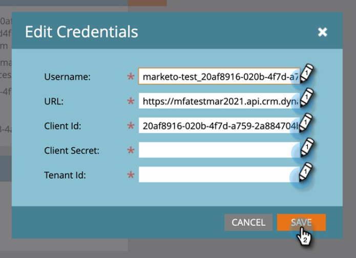
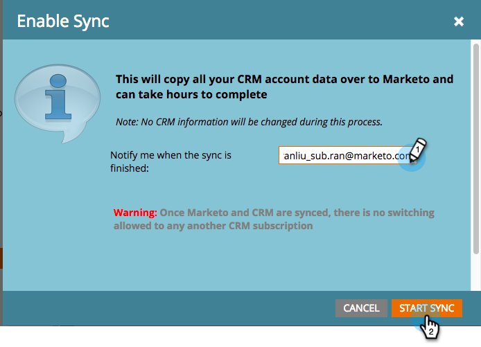

# Passaggio 3 di 3: connettere la soluzione Marketo con la connessione server-server {#step-3-of-3-connect-microsoft-dynamics-with-marketo-solution-s2s}

Ultimo passaggio della sincronizzazione. Ci siamo quasi!

>[!PREREQUISITES]
>
>* [Passaggio 1 di 3: installare la soluzione Marketo con connessione server-server](/help/marketo/product-docs/crm-sync/microsoft-dynamics-sync/sync-setup/microsoft-dynamics-365-with-s2s-connection/step-1-of-3-install.md)
>* [Passaggio 2 di 3: configurare la soluzione Marketo con connessione server-server](/help/marketo/product-docs/crm-sync/microsoft-dynamics-sync/sync-setup/microsoft-dynamics-365-with-s2s-connection/step-2-of-3-set-up.md)

>[!NOTE]
>
>**Autorizzazioni amministratore richieste**

>[!IMPORTANT]
>
>Se aggiorni l’autenticazione di base a OAuth, contatta [Supporto Marketo](https://nation.marketo.com/t5/support/ct-p/Support) per informazioni sull&#39;aggiornamento dei parametri aggiuntivi. Se si abilita questa funzionalità, la sincronizzazione verrà temporaneamente interrotta finché non verranno immesse nuove credenziali e la sincronizzazione non verrà riabilitata. Se desideri ripristinare la modalità di autenticazione precedente, la funzione può essere disabilitata (fino ad aprile 2022).

>[!NOTE]
>
>Prima di immettere le nuove credenziali, è possibile [convalidale qui](/help/marketo/product-docs/crm-sync/microsoft-dynamics-sync/sync-setup/validate-microsoft-dynamics-sync.md).

## Immetti le informazioni utente di Dynamics Sync {#enter-dynamics-sync-user-information}

1. Accedi a Marketo e fai clic su **Amministratore**.

   

1. Fai clic su **CRM**.

   

1. Seleziona **Microsoft**.

   

1. Clic **Modifica** in **Passaggio 1: immettere le credenziali**.

   

   >[!CAUTION]
   >
   >Assicurati che l’URL dell’organizzazione sia corretto, poiché non è possibile ripristinare le modifiche allo schema successive dopo l’invio. Se viene utilizzato un URL organizzazione errato, dovrai ottenere una nuova sottoscrizione Marketo. Se non conosci l’URL, [scopri come trovarlo qui](/help/marketo/product-docs/crm-sync/microsoft-dynamics-sync/sync-setup/view-the-organization-service-url.md).

1. Inserisci le informazioni utente di Dynamics Sync e fai clic su **Salva** al termine.

   

   >[!NOTE]
   >
   >Il nome utente in Marketo deve corrispondere al [indirizzo e-mail](https://docs.microsoft.com/en-us/power-platform/admin/manage-application-users#view-or-edit-the-details-of-an-application-user) dell’utente dell’applicazione nel sistema CRM. Il formato è `user@domain.com` o DOMINIO\utente.

## Seleziona campi da sincronizzare {#select-fields-to-sync}

1. Clic **Modifica** in **Passaggio 2: selezionare i campi da sincronizzare**.

   

1. Seleziona i campi da sincronizzare con Marketo in modo che siano preselezionati. Clic **Salva**.

   

>[!NOTE]
>
>Marketo memorizza un riferimento ai campi da sincronizzare. Se elimini un campo in Dynamics, è consigliabile eseguire questa operazione con [sincronizzazione disabilitata](/help/marketo/product-docs/crm-sync/salesforce-sync/enable-disable-the-salesforce-sync.md). Quindi aggiorna lo schema in Marketo modificando e salvando il file [Seleziona campi da sincronizzare](/help/marketo/product-docs/crm-sync/microsoft-dynamics-sync/microsoft-dynamics-sync-details/microsoft-dynamics-sync-field-sync/editing-fields-to-sync-before-deleting-them-in-dynamics.md).

## Sincronizza campi per un filtro personalizzato {#sync-fields-for-a-custom-filter}

Se hai creato un filtro personalizzato, accertati di entrare e selezionare i nuovi campi da sincronizzare con Marketo.

1. Vai a Amministratore e seleziona **Microsoft Dynamics**.

   

1. Clic **Modifica** in Dettagli sincronizzazione campi.

   

1. Scorri verso il basso fino al campo e selezionalo. Il nome effettivo deve essere new_synctomkto, ma il nome visualizzato può essere qualsiasi cosa. Clic **Salva**.

   

## Abilita sincronizzazione {#enable-sync}

1. Clic **Modifica** in **Passaggio 3: abilitare la sincronizzazione**.

   

   >[!CAUTION]
   >
   >Marketo non eseguirà automaticamente la deduplicazione su una sincronizzazione Microsoft Dynamics o quando immetti manualmente persone o lead.

1. Leggi tutto il contenuto del pop-up, immetti il tuo indirizzo e-mail e fai clic su **Avvia sincronizzazione**.

   

1. La prima sincronizzazione potrebbe richiedere alcune ore. Al termine riceverai una notifica e-mail.

   

Ottimo lavoro!
