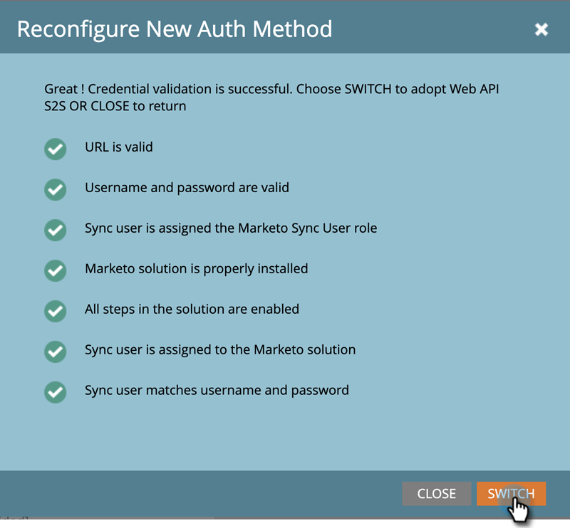

# Riconfigura metodo di autenticazione Dynamics {#reconfigure-dynamics-authentication-method}

Per aggiornare il metodo di autenticazione Dynamics, effettua le seguenti operazioni.

>[!PREREQUISITES]
>
>Imposta l’applicazione in Microsoft Dynamics e nella directory attiva (Azure AD/ADFS) utilizzando il metodo di autenticazione desiderato tra i seguenti articoli:
>
>* [Passaggio 2 di 3: Configurare la soluzione Marketo con la connessione server-to-server](/help/marketo/product-docs/crm-sync/microsoft-dynamics-sync/sync-setup/microsoft-dynamics-365-with-s2s-connection/step-2-of-3-set-up.md)
>* [Passaggio 2 di 4: Configurare la soluzione Marketo con la connessione Controllo password proprietario risorsa](/help/marketo/product-docs/crm-sync/microsoft-dynamics-sync/sync-setup/microsoft-dynamics-365-with-ropc-connection/step-2-of-4-set-up.md)

1. In Marketo fai clic su **Amministratore**.

   

1. Fai clic su **Microsoft Dynamics**, quindi **Disattiva sincronizzazione**.

   

   >[!NOTE]
   >
   >È necessario disattivare temporaneamente la sincronizzazione globale per aggiornare il metodo di autenticazione.

1. Fai clic sul pulsante **Riconfigura nuovo metodo di autenticazione** scheda .

   

1. Seleziona il nuovo metodo di autenticazione desiderato (in questo esempio scegliamo API Web).

   

1. Immetti le credenziali richieste per il nuovo metodo di autenticazione e fai clic su **Convalida**.

   

   >[!NOTE]
   >
   >* I campi specifici variano a seconda del metodo di autenticazione scelto e il modulo viene aggiornato automaticamente a seconda del metodo di autenticazione precedente.
   >* Se hai sincronizzato in precedenza, i dati nel modulo precedente potrebbero essere precompilati. Immetti di nuovo tutte le credenziali per garantire i valori corretti.

1. Se tutto va bene, Convalida sincronizzazione genererà tutti i segni di spunta verdi . Rivedi il messaggio e fai clic su **Interruttore** per aggiornare il metodo di autenticazione.

   

   >[!NOTE]
   >
   >Se vedi un , questo passaggio ha un problema. Vedi [Correggere i problemi di sincronizzazione della convalida di Dynamics](/help/marketo/product-docs/crm-sync/microsoft-dynamics-sync/sync-setup/validate-microsoft-dynamics-sync/fix-dynamics-validation-sync-issues.md) per identificare e risolvere i problemi. Quindi esegui nuovamente i passaggi di convalida della sincronizzazione fino a ottenere un risultato simile all&#39;immagine precedente.

1. Fai clic su **Conferma** per procedere.

   

1. Fai clic su **Conferma** di nuovo.

   

1. Fai clic su **OK**.

   >[!IMPORTANT]
   >
   >Il sistema impiega 15 minuti per accettare la nuova modalità di autenticazione. Attendere 15 minuti dal momento dell&#39;attivazione del commutatore prima di riattivare la sincronizzazione.
