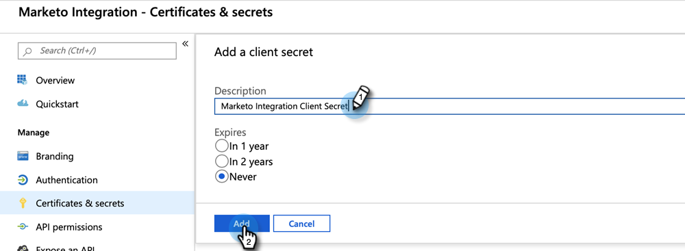

# Configurare l’app Microsoft Dynamics CRM per Online {#set-up-microsoft-dynamics-crm-app-for-online}

## Configurazione {#set-up}

1. Vai su https://docs.microsoft.com/en-us/powerapps/developer/common-data-service/walkthrough-register-app-azure-active-directory#create-an-application-registration.

1. Segui tutti i passaggi. Per il passaggio 3, immettere un nome applicazione pertinente (ad esempio, &quot;Integrazione Marketo&quot;). In Tipi di account supportati, seleziona Account solo in questa directory organizzativa.

1. Annotare l&#39;ID applicazione (ClientId). Sarà necessario inserirlo in Marketo in un secondo momento.

1. Concedi il consenso dell’amministratore seguendo i passaggi descritti in [articolo](/help/marketo/product-docs/crm-sync/microsoft-dynamics-sync/sync-setup/grant-consent-for-client-id-and-app-registration.md).

1. Genera un segreto client in Admin Center facendo clic su **Certificati e segreti**.

   

1. Fai clic su **Nuovo segreto client**.

   

1. Aggiungi una descrizione del segreto client e fai clic su **Aggiungi**.

   

   >[!CAUTION]
   >
   >Accertati di prendere nota del valore Segreto client (mostrato nella schermata seguente), in quanto ne avrai bisogno in un secondo momento. Viene mostrato solo una volta e non potrai recuperarlo di nuovo.

   

Marketo si autentica in Azure AD con OAuth utilizzando le credenziali per la password del proprietario della risorsa di tipo Grant_type ( ROPC). Questo scenario richiede la creazione di un criterio Home Realm Discovery per l&#39;applicazione specifica. Con questo criterio, Azure AD reindirizzerà la richiesta di autenticazione al servizio federativo. A questo scopo, la sincronizzazione hash della password deve essere abilitata in AD Connect. Per ulteriori informazioni, consulta [OAuth con ROPC](https://docs.microsoft.com/en-us/azure/active-directory/develop/v2-oauth-ropc) e [Impostare un criterio hrd per un&#39;applicazione](https://docs.microsoft.com/en-us/azure/active-directory/manage-apps/configure-authentication-for-federated-users-portal#example-set-an-hrd-policy-for-an-application).

Riferimenti aggiuntivi [si trova qui](https://docs.microsoft.com/en-us/azure/active-directory/reports-monitoring/concept-all-sign-ins#:~:text=Interactive%20user%20sign%2Dins%20are,as%20the%20Microsoft%20Authenticator%20app.&amp;text=This%20report%20also%20include%20federated, are%20federated%20to%20Azure%20AD.).

Quando hai finito, è ora di **Immetti l’ID client e il segreto generati da Dynamics CRM in Marketo**.

## Immetti l’ID client e il segreto generati da Dynamics CRM in Marketo {#enter-the-dynamics-crm-generated-client-id-and-secret-into-marketo}

I seguenti passaggi sono applicabili a Online _e_ Versioni on-premise.

1. In Marketo, fai clic su **Amministratore**.

   

1. Fai clic su **Microsoft Dynamics**.

   

1. Fai clic su **Disattiva sincronizzazione**.

   

1. Accanto alle credenziali, fai clic su **Modifica**.

   

1. Inserisci il **ID client** e **Segreto client** recuperate in precedenza e premete **Salva**.

   

1. Fai clic su **Convalida configurazione sincronizzazione**.

   

1. Fai clic su **Successivo**.

   

1. Dovresti visualizzare tutti i segni di spunta verdi. Fai clic su **Chiudi**.

   

   >[!NOTE]
   >
   >Se vedi una X rossa tra i segni di spunta verdi, vedi [articolo](/help/marketo/product-docs/crm-sync/microsoft-dynamics-sync/sync-setup/validate-microsoft-dynamics-sync/fix-dynamics-validation-sync-issues.md) per le opzioni di correzione.

1. Fai clic su **Abilita sincronizzazione**.

   

Ed è tutto!
