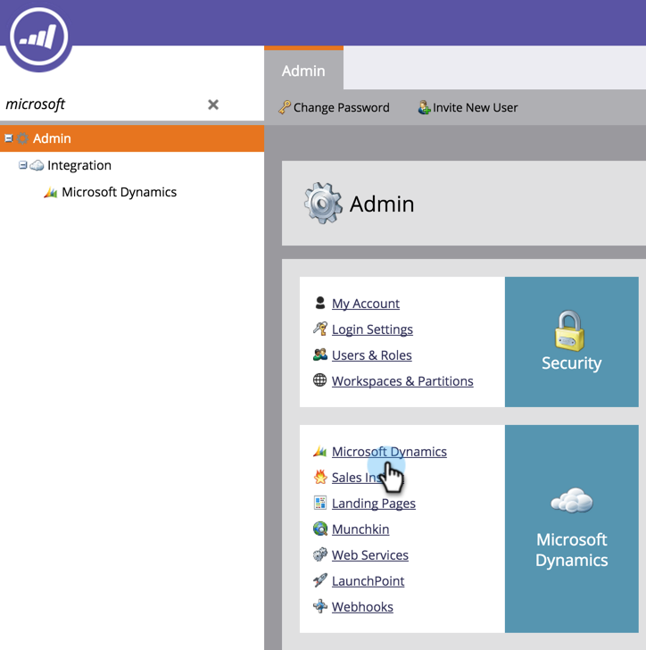
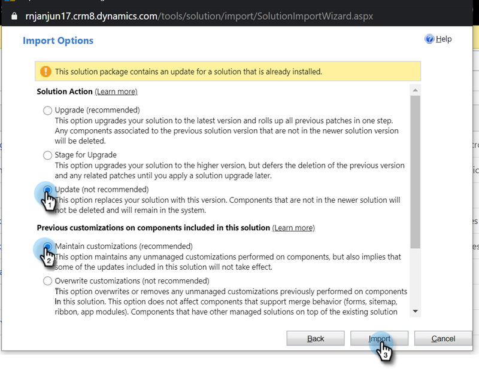

# Aggiorna la soluzione Marketo per [!DNL Microsoft Dynamics] {#update-the-marketo-solution-for-microsoft-dynamics}

Quando viene rilasciata una nuova soluzione [!DNL Microsoft Dynamics], è possibile scaricare l&#39;aggiornamento dall&#39;area Amministratore del proprio account.

>[!NOTE]
>
>**Autorizzazioni amministratore richieste**

>[!CAUTION]
>
>È fondamentale scaricare la soluzione Marketo più recente _prima_ di eseguire qualsiasi aggiornamento.

1. Passa alla schermata **[!UICONTROL Admin]**.

   

1. Fai clic su **[!DNL Microsoft Dynamics]**.

   

1. Seleziona **[!UICONTROL Download Marketo Solution]**.

   

1. Selezionare la soluzione appropriata per la versione [!DNL Microsoft Dynamics].

   

   Fantastico! Ora sul dispositivo viene scaricato un file zip della soluzione. Se non conosci i passaggi di installazione, contatta l&#39;amministratore [!UICONTROL Dynamics].

## Esecuzione dell&#39;aggiornamento {#performing-the-update}

1. Importa la versione più recente della soluzione rispetto alla versione esistente del CRM [!DNL Dynamics] (ad esempio, se il CRM [!DNL Dynamics] ha la versione 1.4 e la versione più recente è 1.5, importare _over_ versione 1.4).

1. Viene visualizzata la seguente finestra a comparsa. Selezionare **[!UICONTROL Update]** e **[!UICONTROL Maintain customizations]**, quindi fare clic su **[!UICONTROL Import]**.

   

>[!CAUTION]
>
>Se si seleziona Aggiorna invece di Aggiorna, i dati potrebbero danneggiarsi nell&#39;ambiente [!DNL Dynamics]. **Scegliere Aggiorna** in [!UICONTROL Import Options].
