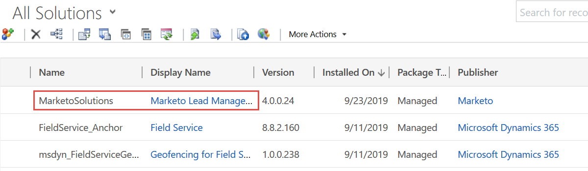

# Correggere i problemi di sincronizzazione della convalida di Dynamics {#fix-dynamics-validation-sync-issues}

## Convalida dei risultati dello strumento di sincronizzazione {#validate-sync-tool-results}

Quando esegui Dynamics Validate Sync, genera un report. Se c&#39;è un  accanto a un passaggio, vedi le opzioni seguenti per identificare e risolvere il problema. Quindi, esegui nuovamente i passaggi di convalida della sincronizzazione fino a quando il risultato non mostra altro che segni di spunta verdi.

## URL valido {#url-is-valid}

Se hai un  in questo caso, verifica che l’URL sia valido. È disponibile qui in Risorse per sviluppatori e consulta Servizio organizzazione. L&#39;URL potrebbe non essere valido per una serie di motivi.

1. Accedi a Dynamics. Fai clic sull’icona Impostazioni e seleziona **Impostazioni avanzate**.

   

1. Fai clic su Impostazioni e seleziona **Personalizzazioni**.

   

1. Fai clic su **Riferimenti per sviluppatori**.

   

1. L&#39;URL del servizio organizzazione si trova in Endpoint di servizio.

   

## Nome utente e password validi {#username-and-password-are-valid}

Se hai un  verifica che il nome utente e la password di Microsoft Dynamics siano validi.

## L&#39;utente di sincronizzazione viene assegnato al ruolo utente di sincronizzazione di Marketo {#sync-user-is-assigned-to-the-marketo-sync-user-role}

Se hai un  qui, potrebbe essere uno dei due motivi seguenti.

**Opzione 1: verificare che il ruolo utente di Marketo Sync sia selezionato in Microsoft Dynamics**:

1. In Dynamics, fai clic sull’icona Impostazioni e seleziona **Impostazioni avanzate**.

   

1. Fai clic su **Impostazioni** e seleziona **Sicurezza**.

   

1. Fai clic su **Utenti.**

   

1. Fai clic sul collegamento per l’utente di sincronizzazione.

   

1. Fai clic su **Gestisci ruoli**.

   

1. Verifica che sia selezionato il ruolo Utente di sincronizzazione di Marketo. In caso contrario, selezionalo e fai clic su **OK.**

   

**Opzione 2 - Conferma il consenso**:

1. Consulta la sezione [Concessione del consenso per l’ID client e la registrazione dell’app](/help/marketo/product-docs/crm-sync/microsoft-dynamics-sync/sync-setup/grant-consent-for-client-id-and-app-registration.md) per confermare che l’app dispone del consenso dell’amministratore per chiamare le API.

## La soluzione Marketo è installata correttamente {#marketo-solution-is-properly-installed}

Se hai un  qui, vai a Microsoft Dynamics per verificare che l’installazione di Marketo sia presente. Consulta il passaggio 1 della documentazione di configurazione di Microsoft Dynamics.

1. In Dynamics, fai clic sull’icona Impostazioni e seleziona **Impostazioni avanzate**.

   

1. Fai clic su **Impostazioni** e seleziona **Soluzioni.**

   

1. Verifica che la soluzione sia elencata.

   

## Tutti i passaggi della soluzione sono abilitati {#all-steps-in-the-solution-are-enabled}

Se hai un  in questo caso, verifica che nessuno dei passaggi predefiniti sia stato disattivato. Tutti i passaggi vengono attivati automaticamente al momento dell’installazione, ma possono essere disattivati durante una personalizzazione.

## L&#39;utente di sincronizzazione viene assegnato alla soluzione Marketo {#sync-user-is-assigned-to-the-marketo-solution}

Se hai un  in questo caso, assicurati che l’utente Sync sia assegnato alla pagina Marketo Default in Microsoft Dynamics.

1. In Dynamics, fai clic sull’icona Impostazioni e seleziona **Impostazioni avanzate**.

   

1. Fai clic su **Impostazioni** e seleziona **Configurazione Marketo**.

   

1. Verifica che l’utente di sincronizzazione sia assegnato come predefinito.

   

## Sincronizza l&#39;utente con nome utente e password {#sync-user-matches-username-and-password}

Se hai un  in questo caso, assicurati di assegnare l’utente di sincronizzazione corretto nel campo Utente Marketo nel passaggio Configurazione predefinita configurazione Marketo in Microsoft Dynamics.

>[!MORELIKETHIS]
>
>[Convalida della sincronizzazione di Microsoft Dynamics](/help/marketo/product-docs/crm-sync/microsoft-dynamics-sync/sync-setup/validate-microsoft-dynamics-sync.md)
