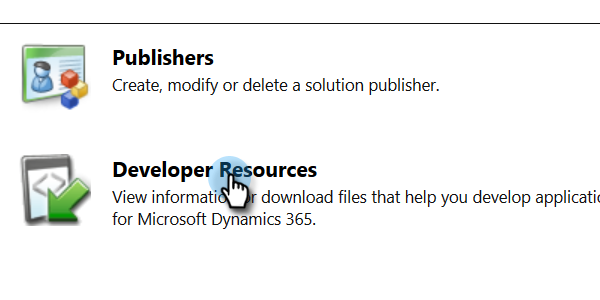

# Correggi i problemi di sincronizzazione della convalida Dynamics {#fix-dynamics-validation-sync-issues}

## Convalida risultati strumento di sincronizzazione {#validate-sync-tool-results}

Quando esegui Dynamics Validate Sync, viene generato un rapporto. Se accanto a un passaggio è presente un , vedere le opzioni seguenti per identificare e risolvere il problema. Quindi, esegui nuovamente i passaggi di convalida della sincronizzazione fino a quando il risultato non mostra nient’altro che segni di spunta verdi.

## URL valido {#url-is-valid}

Se hai un  qui, verifica che l&#39;URL sia valido. Puoi trovarlo qui in Risorse per sviluppatori e consulta Servizio organizzazioni. L’URL potrebbe non essere valido per una serie di motivi.

1. Accedi a Dynamics. Fai clic sull&#39;icona Impostazioni e seleziona **Impostazioni avanzate**.

   

1. Fare clic su Impostazioni e selezionare **Personalizzazioni**.

   

1. Fai clic su **Risorse per sviluppatori**.

   

1. L’URL del servizio organizzazione si trova in Endpoint servizio.

   

## Nome utente e password validi {#username-and-password-are-valid}

Se disponi di , verifica che le credenziali di Microsoft Dynamics siano valide. Per l&#39;autenticazione Web API S2S, il nome utente in Marketo deve corrispondere al [indirizzo e-mail](https://docs.microsoft.com/en-us/power-platform/admin/manage-application-users#view-or-edit-the-details-of-an-application-user) dell&#39;utente dell&#39;applicazione nel CRM. Per gli altri tipi, deve corrispondere al nome utente dell&#39;utente di sincronizzazione.

## L&#39;utente Sync è assegnato al ruolo Utente Sync di Marketo {#sync-user-is-assigned-to-the-marketo-sync-user-role}

Se hai un  qui, potrebbe trattarsi di uno dei tre problemi seguenti.

**Opzione Uno - Verificare Che Il Ruolo Utente Di Marketo Sync Sia Registrato In Microsoft Dynamics**:

1. In Dynamics, fai clic sull&#39;icona Impostazioni e seleziona **Impostazioni avanzate**.

   

1. Fare clic su **Impostazioni** e selezionare **Sicurezza**.

   

1. Fai clic su **Utenti.**

   

1. Fare clic sul collegamento dell&#39;utente di sincronizzazione.

   

1. Fai clic su **Gestisci ruoli**.

   

1. Verificare che il ruolo Utente di sincronizzazione Marketo sia selezionato. In caso contrario, verificarlo e fare clic su **OK.**

   

**Opzione Due - Conferma consenso concessione**:

1. Rivedi [Concedi il consenso per l&#39;ID client e la registrazione dell&#39;app](/help/marketo/product-docs/crm-sync/microsoft-dynamics-sync/sync-setup/grant-consent-for-client-id-and-app-registration.md) per confermare che l&#39;app dispone del consenso amministratore per chiamare le API.

**Opzione Tre - Sincronizza utente**:

1. Verifica che l&#39;utente di sincronizzazione sia aggiunto alla configurazione di Marketo.

## La soluzione Marketo è installata correttamente {#marketo-solution-is-properly-installed}

Se disponi di un  qui, vai a Microsoft Dynamics per verificare che l&#39;installazione di Marketo sia presente. Consulta il passaggio 1 della documentazione di configurazione di Microsoft Dynamics.

1. In Dynamics, fai clic sull&#39;icona Impostazioni e seleziona **Impostazioni avanzate**.

   

1. Fai clic su **Impostazioni** e seleziona **Soluzioni.**

   

1. Verifica che la soluzione sia elencata.

   

## Tutti i passaggi della soluzione sono abilitati {#all-steps-in-the-solution-are-enabled}

Se disponi di  qui, verifica che nessuno dei passaggi predefiniti sia stato disattivato. Tutti i passaggi vengono abilitati automaticamente durante l’installazione, ma possono essere disattivati durante una personalizzazione.

## L&#39;utente di sincronizzazione è assegnato alla soluzione Marketo {#sync-user-is-assigned-to-the-marketo-solution}

Se hai  qui, assicurati che l&#39;utente Sync sia assegnato alla pagina Predefinita di Marketo in Microsoft Dynamics.

1. In Dynamics, fai clic sull&#39;icona Impostazioni e seleziona **Impostazioni avanzate**.

   

1. Fai clic su **Impostazioni** e seleziona **Configurazione Marketo**.

   

1. Verificare che l&#39;utente di sincronizzazione sia assegnato come predefinito.

   

## L&#39;utente di sincronizzazione corrisponde al nome utente e alla password {#sync-user-matches-username-and-password}

Se disponi di un , assicurati di assegnare l&#39;utente di sincronizzazione corretto nel campo Utente di Marketo nel passaggio di installazione predefinita di Marketo Config in Microsoft Dynamics.

>[!MORELIKETHIS]
>
>[Convalida Microsoft Dynamics Sync](/help/marketo/product-docs/crm-sync/microsoft-dynamics-sync/sync-setup/validate-microsoft-dynamics-sync.md)
