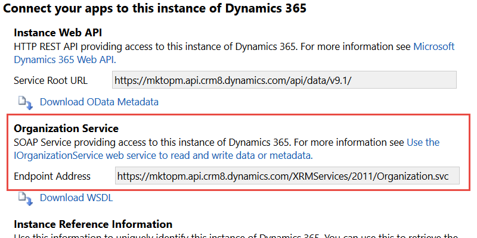

# Visualizza l&#39;URL del servizio organizzazione {#view-the-organization-service-url}

Per eseguire la sincronizzazione con le istanze di Dynamics è necessario che l’URL del servizio Organizzazione sia sincronizzato con Marketo. Ecco come trovarlo in Dynamics.

1. Accedi a Dynamics. Fai clic sull&#39;icona Impostazioni e seleziona **Impostazioni avanzate**.

   

1. Fai clic su **Impostazioni** e seleziona **Personalizzazioni**.

   

1. Fai clic su **Risorse per sviluppatori**.

   

1. L&#39;URL del servizio organizzazione si trova in **Endpoint servizio**.

   

1. Copia e incolla l&#39;URL in Marketo e goditi il resto della sincronizzazione.
