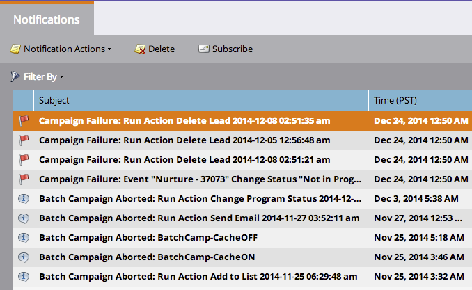

# Aggiungi/rimuovi valori dell&#39;elenco puntato {#add-remove-picklist-values}

Di seguito sono riportate alcune informazioni sull’aggiunta e la rimozione dei valori della lista di selezione in Salesforce.

## Aggiunta di valori della lista di foto {#adding-picklist-values}

1. Se in Salesforce viene aggiunto un valore aggiuntivo a un tipo di campo elenco di selezione, riceverai una [notifica](/help/marketo/product-docs/core-marketo-concepts/miscellaneous/understanding-notifications.md) che identifica i moduli interessati.

   

1. Vai all’editor dei moduli e [aggiungi il valore aggiuntivo](/help/marketo/product-docs/demand-generation/forms/form-actions/add-a-country-picklist-to-your-form.md) all’elenco dei suggerimenti.

## Rimuovi i valori dell&#39;elenco puntato {#remove-picklist-values}

Quando un valore della lista di selezione viene rimosso da un campo in Salesforce, sarà necessario rimuovere manualmente questo valore da tutti i moduli che ospitano questo campo.

>[!NOTE]
>
>Se un campo lead e un campo contatto di Salesforce hanno valori diversi, i valori in comune saranno disponibili per l’utilizzo in Marketo.

Se un campo lead e un campo contatto di Salesforce hanno valori diversi:

1. L’aggiunta di un valore aggiuntivo in SFDC a un elenco di selezione riceverà una notifica.
1. La notifica ti dirà dove viene utilizzato. È ora possibile aggiungere questo nuovo valore come opzione nel modulo, se lo si desidera.

Se un elenco di selezione di un lead SFDC ha valori diversi da un elenco di selezione per un contatto SFDC, i valori comuni verranno utilizzati come opzioni di valore predefinite nel modulo.

Se si rimuove un valore da un elenco di selezione, sarà necessario rimuoverlo manualmente come opzione dai moduli.
