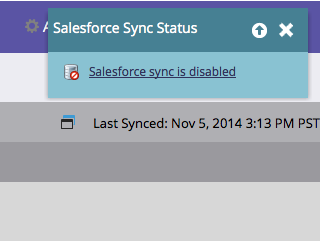

# Attiva/disattiva la sincronizzazione di [!DNL Salesforce] {#enable-disable-the-salesforce-sync}

Quando si apportano modifiche importanti alle impostazioni di sincronizzazione o dei campi, è necessario disattivare la sincronizzazione durante la configurazione. Ecco come:

1. Passare alla sezione **[!UICONTROL Admin]**.

   

1. In **[!UICONTROL Salesforce]**, fare clic su **[!UICONTROL Disable Sync]**.

   

1. La sincronizzazione bidirezionale è ora disattivata e inattiva finché non viene riattivata. [!DNL Salesforce] azioni di flusso continueranno a funzionare.

   

1. Apporta le modifiche e riattiva la sincronizzazione. È lo stesso pulsante.
