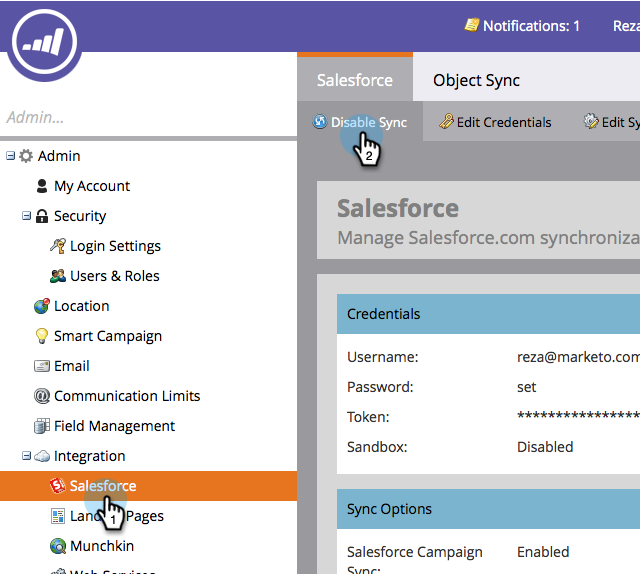

# Abilita/Disattiva sincronizzazione Salesforce {#enable-disable-the-salesforce-sync}

Quando apporti modifiche importanti alle impostazioni di sincronizzazione o campo, devi disattivare la sincronizzazione durante la configurazione. Di seguito è riportata la procedura seguente:

1. Andate alla sezione **Admin**.

   

1. In **Salesforce**, fare clic su **Disattiva sincronizzazione**.

   

1. La sincronizzazione bidirezionale ora è disattivata e inattiva finché non viene riattivata. Le azioni di flusso Salesforce continueranno a funzionare.

   

1. Apportate le modifiche necessarie e riattivate la sincronizzazione. È lo stesso pulsante.
