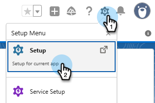
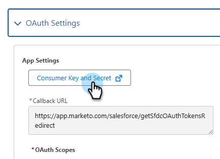

# Accedere utilizzando OAuth 2.0 {#log-in-using-oauth-2-0}

Salesforce utilizza il protocollo OAuth per consentire agli utenti delle applicazioni di accedere in modo sicuro (autenticare l’applicazione utilizzando OAuth 2.0) ai dati senza dover rivelare le credenziali di accesso. Di seguito sono riportati i passaggi da eseguire per collegare e sincronizzare in modo sicuro Marketo Engage con Salesforce.

>[!IMPORTANT]
>
>Per connettere Marketo e [!DNL Salesforce] tramite OAuth, accedi a Marketo tramite un browser privato (in incognito) per evitare di connetterti a [!DNL Salesforce] con un nome utente errato.

## Configurare l’app client esterna {#set-up-external-client-app}

>[!NOTE]
>
>A settembre 2025, Salesforce ha iniziato a limitare l&#39;utilizzo di [app collegate](https://help.salesforce.com/s/articleView?id=005132365&type=1){target="_blank"}. Per gli utenti esistenti che hanno configurato un’app connessa in base alla nostra documentazione, puoi aggiungere l’autorizzazione &quot;Approva app collegate disinstallate&quot; al profilo dell’utente Marketo Sync, oppure creare una nuova app client esterna seguendo le istruzioni riportate di seguito.

1. In Salesforce, fare clic sull&#39;icona a forma di ingranaggio e selezionare **Configurazione**.

   

1. Nella casella Ricerca rapida digitare `App Manager`, quindi selezionare **App Manager**.

   

1. Fare clic su **Nuova app client esterna**.

   

1. Compila i dettagli in _Informazioni di base_. Imposta _Stato distribuzione_ su **Locale**.

   

1. Espandi la sezione **API (Abilita impostazioni OAuth)** e seleziona la casella di controllo **[!UICONTROL Enable OAuth]**. Per _URL callback_, immettere `https://app.marketo.com/salesforce/getSfdcOAuthTokensRedirect`. Selezionate tutti gli ambiti OAuth disponibili e fate clic sulla freccia destra per aggiungerli.

   

1. In _Attivazione flusso_, assicurarsi che non sia selezionata alcuna casella.

   

1. In _Sicurezza_, assicurarsi che siano selezionati solo **Richiedi segreto per il flusso del server Web** e **Richiedi segreto per il flusso del token di aggiornamento**.

   

1. Ignora le ultime quattro sezioni e fai clic su **Crea**.

   

1. Dopo aver creato la nuova app client esterna, seleziona la scheda **Impostazioni** ed espandi la sezione **Impostazioni OAuth**.

   

1. Fai clic sul pulsante **Chiave consumer e segreto** per richiedere l&#39;apertura di una nuova scheda. Copiare e salvare entrambi i numeri (saranno necessari in seguito per l&#39;utilizzo in Marketo Engage).

   

## Configurare Marketo {#set-up-marketo}

>[!PREREQUISITES]
>
>* L&#39;accesso API deve essere abilitato per l&#39;utente di Salesforce Sync (se sei un utente di Salesforce Professional Edition, tale accesso non è disponibile per impostazione predefinita, contatta il tuo Salesforce Account Executive).
>* L&#39;utente di Marketo Sync deve essere creato in Salesforce.
>* Per i clienti esistenti, la funzione &quot;Abilita OAuth per la sincronizzazione con SFDC&quot; è abilitata nell’abbonamento del cliente.
>* Blocchi popup disattivati.
>* L&#39;app connessa è stata creata e sono disponibili [!UICONTROL Consumer Key] e [!UICONTROL Consumer Secret].

>[!CAUTION]
>
>Prima di fare clic su **[!UICONTROL Sync Fields]**, accertarsi di nascondere all&#39;utente di sincronizzazione tutti i campi non necessari in Marketo. Dopo aver fatto clic su Sincronizza campi, tutti i campi che l’utente può visualizzare in SFDC verranno creati in Marketo in modo permanente e non potranno essere eliminati.

1. Nella sezione Amministrazione di Marketo, fare clic su **[!UICONTROL CRM]**, quindi su **[!UICONTROL Sync with Salesforce]**.

   

1. Aggiungi la chiave del consumatore e le informazioni sul segreto del consumatore registrate in precedenza e fai clic su e **[!UICONTROL Save]**.

   

1. Nella pagina di sincronizzazione di Marketo Salesforce fare clic sul pulsante **[!UICONTROL Login with Salesforce]**.

   

   >[!CAUTION]
   >
   >Se vedi campi Nome utente/Password/Token e non un pulsante &quot;Accedi con Salesforce&quot;, l’abbonamento Marketo è abilitato per l’autenticazione di base. Fare riferimento a [Configurazione di Marketo con autenticazione di base](/help/marketo/product-docs/crm-sync/salesforce-sync/setup/enterprise-unlimited-edition/step-3-of-3-connect-marketo-and-salesforce-enterprise-unlimited.md){target="_blank"}. Una volta che la sincronizzazione inizia con un set di credenziali, non si passa da una credenziale di Salesforce all’altra o all’abbonamento. Per configurare Oauth 2.0 per l&#39;autenticazione Salesforce, contattare il [Supporto Marketo](https://nation.marketo.com/t5/support/ct-p/Support){target="_blank"}.

1. Viene visualizzato un pop-up con la pagina di accesso di Salesforce. Inserisci le credenziali &quot;Utente di Marketo Sync&quot; e accedi.

   

1. Immettere il codice di verifica ricevuto tramite e-mail (inviato da Salesforce) e fare clic su **[!UICONTROL Verify]**.

   

1. Una volta completata la verifica, viene visualizzata la pagina di accesso che richiede l’accesso. Fai clic su **[!UICONTROL Allow]**.

   

1. Tra pochi minuti verrà visualizzato un pop-up in Marketo. Fai clic su **[!UICONTROL Confirm Credentials]**.

   

1. Al termine della sincronizzazione dei campi, fare clic su **[!UICONTROL Start Salesforce Sync]**.

   

1. Fai clic su **[!UICONTROL Start Sync]**.

   

La sincronizzazione tra Marketo e [!DNL Salesforce] è in corso.

>[!MORELIKETHIS]
>
>* [Passaggio 1 di 3: aggiunta di campi Marketo a Salesforce (Enterprise/Unlimited)](/help/marketo/product-docs/crm-sync/salesforce-sync/setup/enterprise-unlimited-edition/step-1-of-3-add-marketo-fields-to-salesforce-enterprise-unlimited.md){target="_blank"}
>* [Passaggio 2 di 3: creazione di un utente Salesforce per Marketo (Enterprise/Unlimited)](/help/marketo/product-docs/crm-sync/salesforce-sync/setup/enterprise-unlimited-edition/step-2-of-3-create-a-salesforce-user-for-marketo-enterprise-unlimited.md){target="_blank"}
>* [Installa il pacchetto Marketo Sales Insight in Salesforce AppExchange](/help/marketo/product-docs/marketo-sales-insight/msi-for-salesforce/installation/install-marketo-sales-insight-package-in-salesforce-appexchange.md){target="_blank"}
>* [Configurare Marketo Sales Insight in Salesforce Enterprise/Unlimited](/help/marketo/product-docs/marketo-sales-insight/msi-for-salesforce/configuration/configure-marketo-sales-insight-in-salesforce-enterprise-unlimited.md){target="_blank"}
