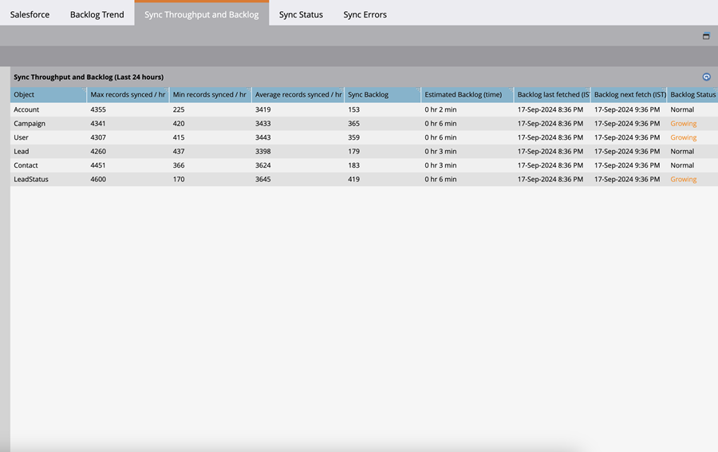

# Metriche backlog di sincronizzazione Salesforce  {#salesforce-sync-backlog-metrics}

Il backlog di sincronizzazione è il nome utilizzato per i record in attesa di sincronizzazione. Tiene conto dei record in attesa di sincronizzazione da Salesforce a Marketo Engage e viceversa. Assicurandoti che il backlog rimanga sotto controllo, le sincronizzazioni saranno regolari e tempestive. Il backlog copre i numeri in attesa di aggiornamenti del post di sincronizzazione su entrambi i lati e non quelli eseguiti da passaggi del flusso di sincronizzazione come i passaggi del flusso Lead di sincronizzazione in SFDC.

## Come accedere {#how-to-access}

1. In Marketo Engage, vai all&#39;area **Amministratore**.

   

1. Seleziona **Salesforce**.

   

## Tendenza backlog di sincronizzazione {#sync-backlog-trend}

La tendenza dell’arretrato riflette le variazioni degli arretrati registrati negli ultimi 5 giorni. Il backlog viene visualizzato in un intervallo di tempo di 4 ore distribuito su 5 giorni. Pertanto, il grafico mostrerà 6 intervalli al giorno per 5 giorni, che equivalgono a 30 intervalli.

Il backlog si osserva a un particolare intervallo di 4 ore sull’asse x. Questo valore si riferisce a tutti gli oggetti sincronizzati. Totale del backlog in Salesforce e nel Marketo Engage in attesa di sincronizzazione.

## Throughput di sincronizzazione e backlog {#sync-throughput-and-backlog}

Le statistiche riflettono la velocità effettiva e lo stato del backlog per ogni tipo di oggetto sincronizzato nelle ultime 24 ore. I tipi di oggetto includono tutti gli oggetti sincronizzati, tra cui: lead, contatto, account, opportunità, campagna, utente e oggetti personalizzati. Le statistiche della velocità effettiva vengono aggiornate automaticamente ogni 15 minuti, ma puoi aggiornare manualmente utilizzando l’icona di aggiornamento. Il backlog viene recuperato ogni ora.

>[!NOTE]
>
>Le statistiche vengono aggiornate su base continua, non per giorno di calendario.

<table><thead>
  <tr>
    <th>Campo</th>
    <th>Descrizione</th>
  </tr></thead>
<tbody>
  <tr>
    <td>Numero massimo di record sincronizzati/ora</td>
    <td>Numero massimo di record sincronizzati all'ora (throughput massimo) osservato nelle ultime 24 ore per il tipo di oggetto. Il periodo di 24 ore ruota con il tempo, non con il giorno di calendario.</td>
  </tr>
  <tr>
    <td>Record minimi sincronizzati / ora</td>
    <td>Numero minimo di record sincronizzati all'ora (velocità effettiva minima) osservati nelle ultime 24 ore per il tipo di oggetto. Il periodo di 24 ore ruota con il tempo, non con il giorno di calendario.</td>
  </tr>
  <tr>
    <td>Media record sincronizzati/ora</td>
    <td>Numero medio di record sincronizzati all'ora (velocità effettiva minima) osservati nelle ultime 24 ore per il tipo di oggetto. Il periodo di 24 ore ruota con il tempo, non con il giorno di calendario. Questo viene calcolato come numero totale di record sincronizzati nelle ultime 24 ore.</td>
  </tr>
  <tr>
    <td>Sincronizza backlog</td>
    <td>Il backlog dei record in attesa di sincronizzazione per il tipo di oggetto. È la somma totale della sincronizzazione in sospeso del backlog in entrambe le direzioni (da Salesforce a Marketo Engage e viceversa). Il backlog da Salesforce viene ottenuto utilizzando una chiamata API a Salesforce e il backlog da Marketo Engage viene calcolato utilizzando le statistiche ottenute dal log dei dati di modifica. Questo viene calcolato ogni ora. I due campi successivi di questa tabella indicano rispettivamente quando è stato calcolato l'ultimo backlog e la pianificazione successiva per il calcolo.</td>
  </tr>
  <tr>
    <td>Backlog stimato (tempo)</td>
    <td>Stima del tempo necessario per sincronizzare il backlog per tipo di oggetto. Calcolato come 'Backlog sincronizzato/Media record sincronizzati all'ora'.</td>
  </tr>
  <tr>
    <td>Ultimo recupero backlog</td>
    <td>Ora dell'ultimo calcolo del backlog.</td>
  </tr>
  <tr>
    <td>Recupero successivo backlog</td>
    <td>Ora del successivo calcolo del backlog.</td>
  </tr>
  <tr>
    <td>Stato backlog</td>
    <td>Questo mostra se il backlog è cresciuto nelle ultime 6 ore. Se il backlog corrente è maggiore del backlog registrato 6 ore fa, viene dedotto "In crescita". In caso contrario, verrà visualizzato come 'Normale'. Questo serve a mostrare se il throughput di sincronizzazione sta raggiungendo il backlog.</td>
  </tr>
</tbody></table>

## Cause dei backlog di sincronizzazione {#what-causes-sync-backlogs}

Sia che l&#39;aggiornamento venga eseguito sul lato Marketo Engage o sul lato CRM, verrà attivata la risincronizzazione del record per aggiornare le informazioni sull&#39;altro lato tramite il normale ciclo di sincronizzazione tra il Marketo Engage e il sistema CRM. Ogni volta che si aggiorna un record in Salesforce, viene generato un timestamp di modifica del sistema, denominato &#39;SysModStamp&#39;. In questo modo viene accodata una modifica alla sincronizzazione.

Quando si esegue una grande quantità di aggiornamenti (ad esempio, se si modifica il valore di un campo), molti record vengono modificati, creando nuovi SysModStamps. Un numero elevato di aggiornamenti dei record persona deve quindi essere risincronizzato tra il Marketo Engage e il CRM, a volte creando un backlog momentaneo.

## Procedure consigliate per la gestione dei backlog di sincronizzazione {#best-practices}

**Campi visibili all&#39;utente di sincronizzazione**: assicurarsi che i campi visibili per la sincronizzazione siano solo quelli che devono essere sincronizzati e che abbiano valore per le attività di marketing. Qualsiasi aggiornamento a un record in Salesforce che aggiorna l’ultima marca temporale modificata accoderà un record al backlog di sincronizzazione e la sincronizzazione di campi non necessari potrebbe rallentare i campi più importanti in fase di sincronizzazione. Se i campi non necessari sono nascosti all&#39;utente di sincronizzazione, gli aggiornamenti apportati a tali campi determineranno un salto molto più rapido rispetto a un aggiornamento. Rivedi qui le best practice con il tuo amministratore di Salesforce e aggiorna i campi visibili all’utente di Marketo Sync.

**Nascondi o filtra i record non necessari**: se un record non è commerciabile, le risorse di sincronizzazione potrebbero andare sprecate. Se l&#39;utente sincronizzato non è in grado di visualizzarlo, non sprecherà le risorse che tenteranno di sincronizzarlo. Il supporto di [Marketo Engage](https://nation.marketo.com/t5/support/ct-p/Support#_blank){target="_blank"} può facilitare la configurazione di un filtro di sincronizzazione per impedire la sincronizzazione dei record in base a criteri aggiuntivi. Ulteriori informazioni sulla configurazione di un filtro di sincronizzazione personalizzato [sono disponibili qui](https://nation.marketo.com/t5/product-blogs/instructions-for-creating-a-custom-sync-rule/ba-p/242758){target="_blank"}. Si consiglia vivamente di utilizzare i campi indice all’interno di Salesforce (per ulteriori informazioni, contatta la forza vendita).

**Pianifica aggiornamenti in blocco durante le ore non critiche**: controlla i modelli di sincronizzazione dei dati per identificare i periodi non critici. Se possibile, controlla se è possibile pianificare aggiornamenti in blocco in questi periodi non critici.

**Campi aggiornati di frequente**: alcuni campi sono soggetti ad aggiornamenti frequenti. Ad esempio, i campi di valuta soggetti a modifiche di valuta. Controlla se è necessario sincronizzarli o se i campi devono essere progettati in modo diverso. Se sono presenti altri campi che vengono aggiornati frequentemente e non sono necessari, nasconderli all&#39;utente di sincronizzazione. Assicurati di discutere con le integrazioni dell’amministratore di SFDC che potrebbero aggiornare i campi.

**Oggetti personalizzati**: controlla periodicamente [oggetti personalizzati](https://experienceleague.adobe.com/en/docs/marketo/using/product-docs/crm-sync/salesforce-sync/sfdc-sync-details/sfdc-sync-custom-object-sync){target="_blank"} abilitati per sincronizzare e disabilitare quelli che non devono più essere sincronizzati.

**Attività**: [Verifica eventuali attività](https://experienceleague.adobe.com/en/docs/marketo/using/product-docs/crm-sync/salesforce-sync/setup/optional-steps/customize-activities-sync){target="_blank"} abilitate per la sincronizzazione che possono essere rimosse.  Queste attività vengono sincronizzate solo una volta al giorno per lead.

**Errori di sincronizzazione recensioni**: la gestione delle eccezioni potrebbe rallentare la sincronizzazione. L&#39;esame delle notifiche degli utenti e la risoluzione degli errori possono migliorare l&#39;integrità della sincronizzazione.

**Contatta il supporto**: se stai seguendo tutte le best practice di cui sopra e stai ancora riscontrando backlog significativi, contatta il [supporto di Marketo Engage](https://nation.marketo.com/t5/support/ct-p/Support#_blank){target="_blank"}.
