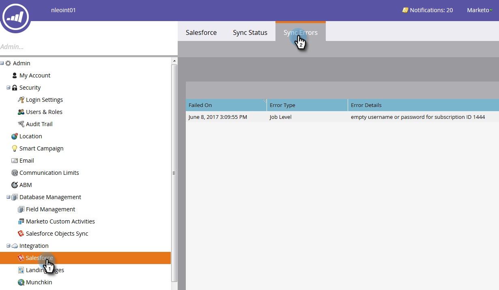

# [!DNL Salesforce] errori di sincronizzazione {#salesforce-sync-errors}

Visualizza un riepilogo degli errori riscontrati durante il processo di sincronizzazione. Sono inclusi gli errori causati da errori di sincronizzazione dei dati non compatibili.

>[!NOTE]
>
>**Autorizzazioni amministratore richieste**

## Visualizza errori di sincronizzazione {#view-sync-errors}

1. Fai clic su **[!UICONTROL Admin]**.

   

1. In Integrazione, fare clic su **Salesforce**, quindi sulla scheda **[!UICONTROL Sync Errors]**.

   

>[!NOTE]
>
>Gli errori elencati vanno dall&#39;ora corrente ai cinque giorni precedenti la sincronizzazione corrente.

| Campo | Descrizione |
|---|---|
| Non riuscito il | Livello record _o_ livello processo |
| Data/ora dell’errore | Dettagli errore |
| Tipo di errore | Messaggio di ritorno SFDC |

>[!TIP]
>
>Facendo clic sul record a livello di record vengono visualizzati gli ID Marketo e [!DNL Salesforce] dell&#39;oggetto correlato. In alcuni casi, il messaggio sugli errori a livello di record e di processo proviene direttamente da [!DNL Salesforce]. Per ulteriori informazioni, vedere Ricerca in linea.

## Errori di sincronizzazione filtri {#filter-sync-errors}

1. Per filtrare i dati, fai clic sull’icona del filtro posta all’estrema destra della pagina.

   

1. Seleziona l’intervallo di date e ore, quindi filtra per tipo di errore (livello processo o livello record). Al termine, fai clic su **[!UICONTROL Apply]**.

   

**PASSAGGIO FACOLTATIVO**: per esportare gli errori di sincronizzazione, fare clic su **[!UICONTROL Export]**. I dati verranno esportati come file CSV.

