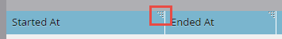

# Stato di sincronizzazione Salesforce {#salesforce-sync-status}

Utilizza il dashboard Stato di sincronizzazione per visualizzare le statistiche di sincronizzazione come parte dei passaggi di sincronizzazione e il relativo stato di completamento.

I passaggi di sincronizzazione riflettono le operazioni di push o pull di ciascun tipo di oggetto per lo schema dell’oggetto e i dati stessi. Le statistiche riguardano nuovi record, aggiornamenti, eliminazioni e conteggi di errori durante la sincronizzazione. Gli utenti possono filtrare per data, tipo di operazione o tipo di oggetto. Il dashboard Stato di sincronizzazione mostra lo stato dei cicli di sincronizzazione per gli ultimi cinque giorni.

>[!NOTE]
>
>Autorizzazioni amministratore richieste

## Visualizza stato di sincronizzazione {#view-sync-status}

1. Clic **Amministratore**.

   

1. In Integrazione, fai clic su Salesforce, quindi sulla scheda Stato di sincronizzazione.

   

Per impostazione predefinita, le statistiche vengono ordinate in base all’ultimo avvio. È possibile ordinare in base a Iniziato o Terminato alle, dal più recente al meno recente, facendo clic sull&#39;icona di ordinamento.

## Filtra stato sincronizzazione {#filter-sync-status}

1. Per filtrare i dati, fai clic sull’icona del filtro posta all’estrema destra della pagina.

   

1. Selezionare l&#39;intervallo di date e ore, quindi fare clic sull&#39;elenco a discesa per filtrare in base al tipo di oggetto, al tipo di operazione e/o al tipo di stato.

   

1. Clic **Applica**.

   

**PASSAGGIO FACOLTATIVO**: per esportare gli errori di sincronizzazione, fai clic su **Esporta**. I dati verranno esportati come file CSV.

## Sincronizza campi stato {#sync-status-fields}

<table> 
 <colgroup> 
  <col> 
  <col> 
  <col> 
 </colgroup> 
 <tbody> 
  <tr> 
   <th>Campo</th> 
   <th>Descrizione</th> 
   <th>Valori enum</th> 
  </tr> 
  <tr> 
   <td colspan="1">Iniziato alle</td> 
   <td colspan="1">Data/ora di inizio del ciclo di sincronizzazione (fuso orario dell'utente)</td> 
   <td colspan="1"></td> 
  </tr>  
  <tr> 
   <td colspan="1">Terminato il</td> 
   <td colspan="1">Data/ora di fine del ciclo di sincronizzazione (fuso orario dell'utente)</td> 
   <td colspan="1"></td> 
  </tr> 
  <tr> 
   <td colspan="1">Oggetto</td> 
   <td colspan="1">Tipo di oggetto</td> 
   <td colspan="1">Contatto, Persona, Attività, Opportunità, Lead, Altri come segue</td> 
  </tr>  
  <tr> 
   <td colspan="1">Operazione</td> 
   <td colspan="1">Tipo di operazione</td> 
   <td colspan="1">Tipi di operazioni:</td> 
  </tr>  
  <tr> 
   <td colspan="1">Stato</td> 
   <td colspan="1">Stato del batch</td> 
   <td colspan="1">Operazione riuscita, non riuscita, incompleta, in corso, pulita*</td> 
  </tr>
  <tr> 
   <td colspan="1">Nuovo</td> 
   <td colspan="1">Numero di nuovi record</td> 
   <td colspan="1"></td> 
  </tr>  
  <tr> 
   <td colspan="1">Aggiornato</td> 
   <td colspan="1">Numero di record aggiornati</td> 
   <td colspan="1"></td> 
  </tr>  
  <tr> 
   <td colspan="1">Eliminato</td> 
   <td colspan="1">Numero di record eliminati</td> 
   <td colspan="1"></td> 
  </tr> 
  <tr> 
   <td colspan="1">Elemento non riuscito</td> 
   <td colspan="1">Numero di record con sincronizzazione non riuscita</td> 
   <td colspan="1"> </td> 
  </tr>  
  <tr> 
   <td colspan="1">Ignorato</td> 
   <td colspan="1">Numero di record ignorati perché non sono state apportate modifiche ai campi di interesse per la sincronizzazione</td> 
   <td colspan="1"></td> 
  </tr>  
 </tbody> 
</table>

&#42;Dati ripristinati allo stato precedente di integrità dopo un errore del passaggio di sincronizzazione.

## Tipo di oggetto {#object-type}

<table> 
 <colgroup> 
  <col> 
 </colgroup> 
 <tbody> 
  <tr> 
   <td colspan="1">Account</td> 
  </tr>  
  <tr> 
   <td colspan="1">Tipo di account</td> 
  </tr> 
  <tr> 
   <td colspan="1">Oggetti personalizzati</td> 
  </tr>  
  <tr> 
   <td colspan="1">Campagna</td> 
  </tr>  
  <tr> 
   <td colspan="1">Stato membro della campagna</td> 
  </tr>
  <tr> 
   <td colspan="1">Contatto</td> 
  </tr>  
  <tr> 
   <td colspan="1">Modello e-mail</td> 
  </tr>  
  <tr> 
   <td colspan="1">Evento</td> 
  </tr> 
  <tr> 
   <td colspan="1">Persona (lead)</td> 
  </tr>  
  <tr> 
   <td colspan="1">Opportunità</td> 
  </tr>  
  <tr> 
   <td colspan="1">Ruolo contatto opportunità</td> 
  </tr>  
  <tr> 
   <td colspan="1">Attività</td> 
  </tr>  
  <tr> 
   <td colspan="1">Utente</td> 
  </tr>  
 </tbody> 
</table>

## Tipo di operazione {#operation-type}

<table> 
 <colgroup> 
  <col> 
  <col> 
  <col>
  <col> 
 </colgroup> 
 <tbody> 
  <tr> 
   <th>Tipo di operazione</th> 
   <th>Trovato rispetto a questi oggetti</th> 
   <th>Osservazioni</th> 
   <th>Tipo di operazione</th>
  </tr> 
  <tr> 
   <td colspan="1">Collegamento iniziale con il programma</td> 
   <td colspan="1">Campagna</td> 
   <td colspan="1">Collegamento di campagne a programmi</td> 
   <td colspan="1">Aggiorna</td>
  </tr>  
  <tr> 
   <td colspan="1">Conversioni pull</td> 
   <td colspan="1">Persona (lead)*</td> 
   <td colspan="1">Azioni di conversione pull da SFDC a Marketo. Le unità (numeri) sono lead che si convertono in contatti</td> 
   <td colspan="1">Aggiornamento, elemento non riuscito o ignorato</td>
  </tr> 
  <tr> 
   <td colspan="1">Eliminazioni pull</td> 
   <td colspan="1">Contatto, Persona (lead), Opportunità, Campagna, Membri campagna, Contatto opportunità, Oggetti personalizzati, Campagne, Stato membro campagna, Ruolo contatto opportunità</td> 
   <td colspan="1">Record eliminati di SFDC sincronizzati in Marketo</td> 
   <td colspan="1">Eliminato, Elemento non riuscito o Ignorato</td>
  </tr>  
  <tr> 
   <td colspan="1">Aggiornamenti pull</td> 
   <td colspan="1">Attività, Persona (Lead), Persona (Lead) Coda, Contatto, Evento, Opportunità, Account, Tipo Di Account, Membri Della Campagna, Oggetti Personalizzati, Campagne, Stato Membro Della Campagna, Eventi, Stato Persona, Opportunità, Ruolo Contatto Opportunità</td> 
   <td colspan="1">Aggiornamenti o nuovi record in SFDC sincronizzati in Marketo; pull di eventi come attività</td> 
   <td colspan="1">Nuovo, aggiornato, non riuscito o saltato</td>
  </tr>  
  <tr> 
   <td colspan="1">Invia nuovo</td> 
   <td colspan="1">Attività, Modelli e-mail</td> 
   <td colspan="1">Attività push</td> 
   <td colspan="1"></td>
  </tr>
  <tr> 
   <td colspan="1">Aggiornamenti push</td> 
   <td colspan="1">Attività, Modelli e-mail, Persona, Contatto, Campagne</td> 
   <td colspan="1">Invio di aggiornamenti a SFDC ed eliminazioni</td> 
   <td colspan="1">Aggiornamento, elemento non riuscito o ignorato</td>
  </tr>  
  <tr> 
   <td colspan="1">Sincronizza schema</td> 
   <td colspan="1">Membri campagna, Oggetti personalizzati, Campagne, Stato membro campagna, Attività, Persona, Opportunità, Ruolo contatto opportunità, Utenti</td> 
   <td colspan="1">Sincronizza i metadati per oggetti diversi, per decidere quali nuovi campi sincronizzare nel ciclo successivo</td> 
   <td colspan="1"></td>
  </tr>  
  <tr> 
   <td colspan="1">Sincronizza con programma</td> 
   <td colspan="1">Campagne</td> 
   <td colspan="1">Sincronizza il programma Marketo con le campagne SFDC</td> 
   <td colspan="1">Nuovo, Aggiornamenti, Non riuscito o Ignorato</td>
  </tr> 
  <tr> 
   <td colspan="1">Aggiornare le attività</td> 
   <td colspan="1">Attività</td> 
   <td colspan="1">Attività pull da Salesforce</td> 
   <td colspan="1"></td>
  </tr>  
  <tr> 
   <td colspan="1">Aggiorna FKS</td> 
   <td colspan="1">Tutte</td> 
   <td colspan="1">Aggiorna chiave esterna di tutti gli oggetti</td> 
   <td colspan="1">N/D</td>
  </tr>  
 </tbody> 
</table>

&#42;La configurazione del branding a livello di abbonamento determina l’etichetta: &quot;Lead&quot; o &quot;Persona&quot; nel rapporto.
