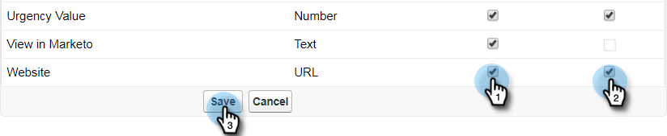

# Passaggio 2 di 3: creare un utente Salesforce per Marketo (Enterprise/Unlimited) {#step-of-create-a-salesforce-user-for-marketo-enterprise-unlimited}

>[!NOTE]
>
>Questi passaggi devono essere completati da un amministratore Salesforce

>[!PREREQUISITES]
>
>[Passaggio 1 di 3: aggiunta di campi Marketo a Salesforce (Enterprise/Unlimited)](/help/marketo/product-docs/crm-sync/salesforce-sync/setup/enterprise-unlimited-edition/step-1-of-3-add-marketo-fields-to-salesforce-enterprise-unlimited.md)

In questo articolo, configurerai le autorizzazioni utente nel profilo Salesforce e creerai un account di integrazione Marketo-Salesforce.

## Creare un profilo {#create-a-profile}

1. Clic **Configurazione**.

   

1. Digita &quot;profiles&quot; nella barra di ricerca di navigazione e fai clic sul pulsante **Profili** collegamento.

   

1. Fai clic su **Nuovo**.

   

1. Seleziona **Utente standard**, assegna al profilo il nome &quot;Marketo-Salesforce Sync&quot; e fai clic su **Salva**.

   

## Imposta autorizzazioni profilo {#set-profile-permissions}

1. Clic **Modifica** per impostare le autorizzazioni di protezione.

   

1. Sotto **Autorizzazioni amministrative** sezione, assicurarsi che siano selezionate le caselle seguenti:

   * API abilitata
   * Modifica modelli di HTML
   * Gestisci documenti pubblici
   * Gestisci modelli pubblici

   

   >[!TIP]
   >
   >Verificare che il **La password non scade** casella.

1. Nella sezione Autorizzazioni utente generali verificare che siano selezionate le caselle seguenti:

   * Converti lead
   * Modifica eventi
   * Modifica le Attività

   

1. Nella sezione Autorizzazioni oggetto standard verificare che le autorizzazioni di lettura, creazione, modifica ed eliminazione siano verificate per:

   * Account
   * Campagne
   * Contatti
   * Lead
   * Opportunità

   >[!NOTE]
   >
   >Concedi le autorizzazioni per le campagne, se intendi utilizzare Campaign Sync.

   

1. Al termine, fai clic su **Salva** nella parte inferiore della pagina.

   

## Imposta autorizzazioni campo {#set-field-permissions}

1. Rivolgiti ai tuoi esperti di marketing per scoprire quali campi personalizzati sono necessari per la sincronizzazione.

   >[!NOTE]
   >
   >Questo passaggio impedisce la visualizzazione dei campi non necessari in Marketo, riducendo il disordine e velocizzando la sincronizzazione.

1. Nella pagina dei dettagli del profilo, vai a **Sicurezza a livello di campo** sezione. Clic **Visualizza** per modificare l&#39;accessibilità per gli oggetti:

   * Lead
   * Contatto
   * Account
   * Opportunità

   >[!TIP]
   >
   >Puoi configurare altri oggetti in base alle esigenze della tua organizzazione.

   

1. Per ogni oggetto, fai clic su **Modifica**.

   

1. Individua i campi non necessari, assicurati che **Accesso in lettura** e **Modifica accesso** sono deselezionate. Clic **Salva** quando hai finito.

   >[!NOTE]
   >
   >Modifica solo l’accessibilità per i campi personalizzati.

   

1. Dopo aver disabilitato tutti i campi non necessari, è necessario selezionare **Accesso in lettura e accesso in modifica** per i seguenti campi oggetto. Clic **Salva** quando hai finito.

<table> 
 <tbody> 
  <tr> 
   <th colspan="1" rowspan="1">
Oggetto
</th> 
   <th colspan="1" rowspan="1">
Campi
</th> 
  </tr> 
  <tr> 
   <td colspan="1" rowspan="1">
Account
</td> 
   <td colspan="1" rowspan="1">
Campo tipo
</td> 
  </tr> 
  <tr> 
   <td colspan="1" rowspan="1">
Evento
</td> 
   <td colspan="1" rowspan="1">
Tutti i campi
</td> 
  </tr> 
  <tr> 
   <td colspan="1" rowspan="1">
Attività
</td> 
   <td colspan="1" rowspan="1">
Tutti i campi
</td> 
  </tr> 
 </tbody> 
</table>

## Crea account di sincronizzazione Marketo-Salesforce {#create-marketo-salesforce-sync-account}

>[!TIP]
>
>Crea un account Salesforce dedicato (ad esempio, marketo@yourcompany.com) per distinguere le modifiche apportate da Marketo rispetto ad altri utenti Salesforce.

1. Digita &quot;Gestisci utenti&quot; nella barra di ricerca di navigazione, quindi fai clic su **Utenti**. Fai clic su **Nuovo utente**.

   

1. Compila i campi obbligatori. Quindi, seleziona la **Licenza utente: Salesforce** e il profilo creato in precedenza. Clic **Salva** quando hai finito.

   

Viene completato il passaggio 2 di 2.

>[!NOTE]
>
>[Passaggio 3 di 3: Connessione di Marketo e Salesforce (Enterprise/Unlimited)](/help/marketo/product-docs/crm-sync/salesforce-sync/setup/enterprise-unlimited-edition/step-3-of-3-connect-marketo-and-salesforce-enterprise-unlimited.md)
