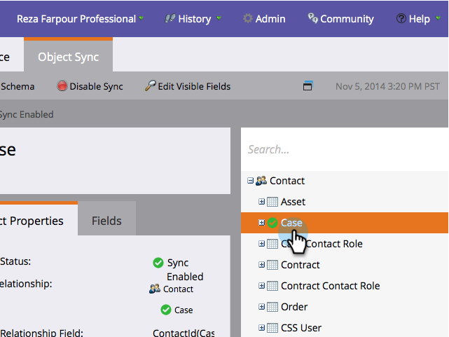

# Aggiungi/rimuovi campo oggetto personalizzato come vincoli di elenco avanzato/trigger {#add-remove-custom-object-field-as-smart-list-trigger-constraints}

Marketo offre un controllo a grana fine sulla sincronizzazione di oggetti personalizzati Salesforce. Questo consente di selezionare i campi disponibili come vincoli nei filtri oggetti personalizzati e di utilizzarli come attivatori nelle campagne avanzate.

>[!NOTE]
>
>**Autorizzazioni amministratore richieste**

1. Fare clic su **Amministratore.**

   

1. Fare clic su **Amministratore**, quindi su **Sincronizzazione oggetti Salesforce.**

   

1. **Salesforce Objects** Syncappears nella colonna sinistra.

   

1. Selezionare l&#39;oggetto da modificare.

   

1. Fare clic su **Modifica campi visibili**.

   >[!TIP]
   >
   >Se il pulsante **Modifica campi visibili** è disattivato, l&#39;oggetto è attualmente utilizzato in un elenco smart o in una campagna avanzata. Rimuovere tutte le associazioni per continuare.

   

1. Se la sincronizzazione globale è abilitata, fai clic su **Disattiva sincronizzazione globale**.

   

1. Seleziona le caselle accanto ai vincoli di filtro/trigger necessari e fai clic su **Salva**.

   

   >[!NOTE]
   >
   >Per impostazione predefinita, tutti i campi sono selezionati come vincoli per i filtri.

1. Fai clic sulla scheda **Campi** per confermare le modifiche.

   

   >[!NOTE]
   >
   >Non dimenticare di riabilitare la sincronizzazione globale.

Wow! Ora le tue smart list e campagne intelligenti hanno ancora più potenza.

>[!MORELIKETHIS]
>
>[Attiva/Disattiva la sincronizzazione personalizzata degli oggetti](/help/marketo/product-docs/crm-sync/salesforce-sync/setup/optional-steps/enable-disable-custom-object-sync.md)
