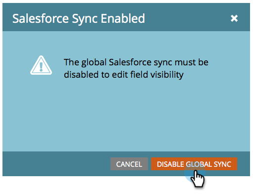

# Aggiungere/rimuovere campo oggetto personalizzato come vincoli di elenco avanzato/trigger {#add-remove-custom-object-field-as-smart-list-trigger-constraints}

Marketo Engage offre un controllo dettagliato sulla sincronizzazione personalizzata degli oggetti di Salesforce. Questo consente di selezionare i campi disponibili come vincoli nei filtri oggetto personalizzati e di utilizzarli come attivatori nelle campagne avanzate.

>[!NOTE]
>
>**Autorizzazioni amministratore richieste**

1. Fare clic su **[!UICONTROL Admin].**

   

1. Fare clic su **[!UICONTROL Admin]** e quindi su **[!UICONTROL Salesforce Objects Sync].**

   

1. **[!UICONTROL Salesforce Objects Sync]** viene visualizzato nella colonna sinistra.

   

1. Selezionare l&#39;oggetto da modificare.

   

1. Fai clic su **[!UICONTROL Edit Visible Fields]**.

   >[!TIP]
   >
   >Se il pulsante **[!UICONTROL Edit Visible Fields]** è disattivato, l&#39;oggetto è attualmente in uso in un elenco avanzato o in una campagna avanzata. Rimuovere tutte le associazioni per continuare.

   

1. Se la sincronizzazione globale è abilitata, fare clic su **[!UICONTROL Disable Global Sync]**.

   

1. Selezionare le caselle accanto ai vincoli di filtro/trigger necessari e fare clic su **[!UICONTROL Save]**.

   

   >[!NOTE]
   >
   >Per impostazione predefinita, tutti i campi sono selezionati come vincoli sui filtri.

1. Fai clic sulla scheda **[!UICONTROL Fields]** per confermare le modifiche.

   

   >[!NOTE]
   >
   >Ricordati di riattivare la sincronizzazione globale.

Ora i tuoi elenchi avanzati e le campagne avanzate hanno ancora più potenza.

>[!MORELIKETHIS]
>
>[Attiva/Disattiva Sincronizzazione Oggetto Personalizzato](/help/marketo/product-docs/crm-sync/salesforce-sync/setup/optional-steps/enable-disable-custom-object-sync.md){target="_blank"}
