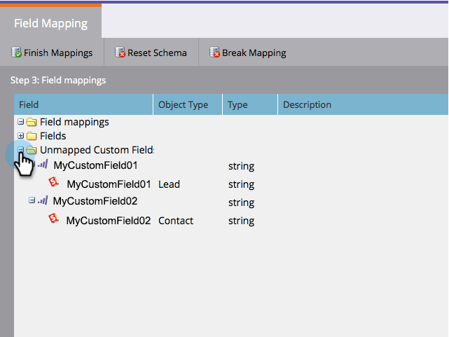
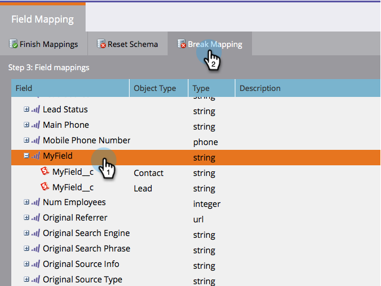
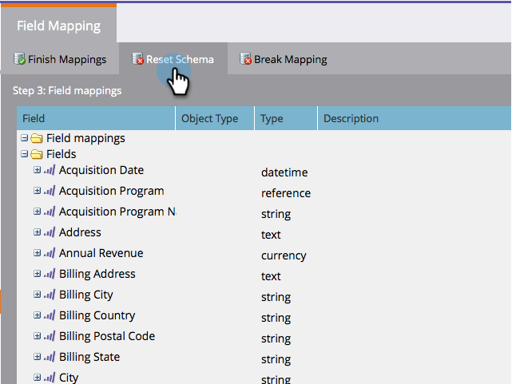

# Modifica mappature campi iniziali {#edit-initial-field-mappings}

>[!NOTE]
>
>Questa funzione è accessibile solo prima della sincronizzazione iniziale con Salesforce! Una volta che **Sincronizza** Questo non può più essere fatto.

Durante la sincronizzazione iniziale con Salesforce, Marketo combina automaticamente campi personalizzati con nomi simili in un singolo campo sul lato Marketo per garantire che i dati possano essere scambiati con oggetti Lead e Contact nel CRM. Questo articolo spiega come personalizzare queste mappature.

## Mappa campi non mappati {#map-unmapped-fields}

Quando viene visualizzato un campo nella cartella Campi non mappati, significa che non è mappato a un campo simile nel lead o nel contatto di Salesforce. Puoi ripararlo.

1. Fai clic su **Modifica mappature**.

1. Apri **Campi personalizzati non mappati** cartella.

   

1. Trascina un campo personalizzato non mappato su un altro per mapparlo insieme.

   >[!NOTE]
   >
   >Puoi modificare solo le mappature dei campi personalizzate. Impossibile modificare le mappature dei campi standard.

   

1. Fai clic su **Mappature di fine** quando hai finito.

   

## Interrompi mappatura esistente {#break-existing-mapping}

Se nell’oggetto lead sono presenti campi con nomi simili, Marketo li associa automaticamente. Puoi considerarli diversi e conservare dati diversi. Rompete la mappatura in questo modo.

1. Fai clic su **Modifica mappature**.

   

1. Evidenziare un campo mappato e fare clic su **Mappatura interruzione** per separare i campi.

   

1. Fai clic su **Mappature di fine** quando hai finito.

   

   Bello! Hai quasi finito con la sincronizzazione iniziale.

## Ripristina schema {#reset-schema}

1. Se apporti alcune modifiche allo schema in Salesforce mentre lavori alle mappature, puoi estrarre le modifiche facendo clic su **Ripristina schema**.

   * Tutte le modifiche alla mappatura verranno reimpostate.
   * Se si reimposta lo schema, verranno aggiunti solo i campi, non rimossi (anche se li si nasconde dall&#39;utente di sincronizzazione).
   
