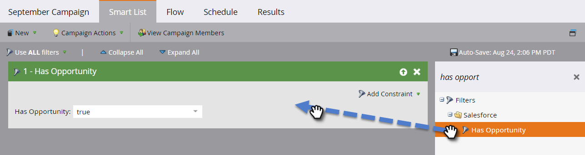

# Attiva/disattiva la sincronizzazione personalizzata degli oggetti {#enable-disable-custom-object-sync}

Gli oggetti personalizzati creati nella tua istanza Salesforce possono far parte anche di Marketo. Ecco come configurarlo.

## Attiva/disattiva la sincronizzazione personalizzata degli oggetti {#enable-disable-custom-object-sync-1}

>[!NOTE]
>
>Sono richiesti i diritti di amministratore.

1. Fai clic su **Amministratore**.

   

1. Nel menu Gestione database fare clic su **Sincronizzazione oggetti Salesforce**.

   

1. Se si tratta del primo oggetto personalizzato, fare clic su **Sincronizza schema.** In caso contrario, fare clic su  **Aggiorna** schema per verificare di disporre della versione più recente.

   

1. Se la sincronizzazione globale è in esecuzione, è necessario disattivarla facendo clic su **Disattiva sincronizzazione globale.**

   

   >[!NOTE]
   >
   >La sincronizzazione dello schema di oggetti personalizzati Salesforce potrebbe richiedere alcuni minuti.

1. Fare clic su **Aggiorna schema**.

   

1. Selezionare l&#39;oggetto da sincronizzare e fare clic su **Abilita sincronizzazione**.

   >[!TIP]
   >
   >Marketo può sincronizzare un oggetto personalizzato solo se ha una relazione diretta con l’oggetto Lead, Contatto o Account in Salesforce.

   

1. Fare nuovamente clic su **Abilita sincronizzazione**.

   

1. Torna alla scheda **Salesforce** e fai clic su **Abilita sincronizzazione**.

   

## Utilizzo degli oggetti personalizzati {#using-your-custom-objects}

>[!NOTE]
>
>Non è possibile utilizzare oggetti personalizzati nelle campagne avanzate con i trigger.

1. Nell’elenco avanzato, trascina il filtro **Con opportunità** e imposta su **true**.

   

1. Quindi, utilizza i vincoli del filtro per restringere lo stato attivo.

   

   Eccellente! È ora possibile utilizzare i dati di questo oggetto personalizzato nelle campagne avanzate e negli elenchi smart.

>[!MORELIKETHIS]
>
>[Aggiungi/rimuovi campo di oggetto personalizzato come vincoli di elenco avanzato/trigger](/help/marketo/product-docs/crm-sync/salesforce-sync/setup/optional-steps/add-remove-custom-object-field-as-smart-list-trigger-constraints.md)
