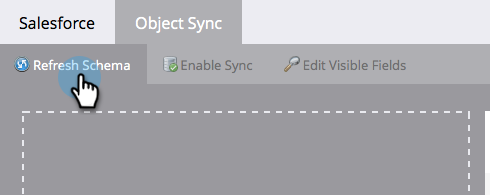
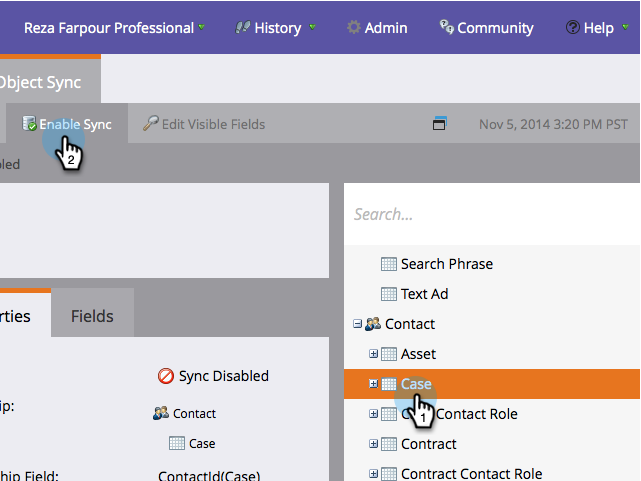
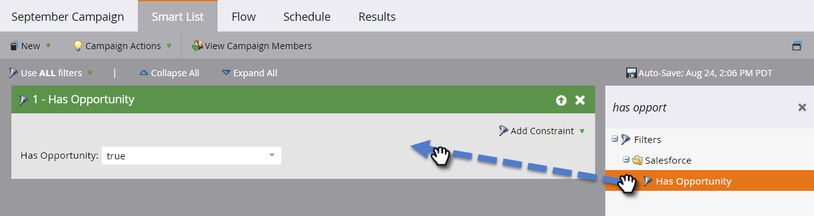

# Abilitare/disabilitare la sincronizzazione oggetti personalizzati {#enable-disable-custom-object-sync}

Anche gli oggetti personalizzati creati nell’istanza Salesforce possono far parte di Marketo Engage. Ecco come configurarlo.

## Abilitare/disabilitare la sincronizzazione oggetti personalizzati {#enable-disable-custom-object-sync-1}

>[!NOTE]
>
>**Autorizzazioni amministratore richieste**

1. Passa alla schermata **[!UICONTROL Admin]**.

   

1. Scegliere **[!UICONTROL Salesforce Objects Sync]** dal menu Gestione database.

   

1. Se si tratta del primo oggetto personalizzato, fare clic su **[!UICONTROL Sync schema]**. In caso contrario, fai clic su **[!UICONTROL Refresh Schema]** per assicurarti di disporre dell&#39;ultima versione.

   

1. Se la sincronizzazione globale è in esecuzione, sarà necessario disattivarla facendo clic su **[!UICONTROL Disable Global Sync]**.

   

   >[!NOTE]
   >
   >La sincronizzazione dello schema di oggetti personalizzato [!DNL Salesforce] potrebbe richiedere alcuni minuti.

1. Fai clic su **[!UICONTROL Refresh Schema]**.

   

1. Selezionare l&#39;oggetto da sincronizzare e fare clic su **[!UICONTROL Enable Sync]**.

   >[!TIP]
   >
   >Marketo può sincronizzare un oggetto personalizzato solo se ha una relazione diretta con l&#39;oggetto Lead, Contact o Account in [!DNL Salesforce].

   

1. Fare di nuovo clic su **[!UICONTROL Enable Sync]**.

   

1. Tornare alla scheda **[!DNL Salesforce]** e fare clic su **[!UICONTROL Enable Sync]**.

   

## Utilizzo degli oggetti personalizzati {#using-your-custom-objects}

>[!NOTE]
>
>Non è possibile utilizzare oggetti personalizzati in Smart Campaigns con trigger.

1. Nell&#39;elenco avanzato, trascinare il mouse sul filtro **[!UICONTROL Has Opportunity]** e impostare su **[!UICONTROL true]**.

   

1. Quindi, utilizzate i vincoli di filtro per restringere lo stato attivo.

   

   Eccellente! È ora possibile utilizzare i dati di questo oggetto personalizzato nelle campagne avanzate e negli elenchi avanzati.

>[!MORELIKETHIS]
>
>[Aggiungi/Rimuovi campo oggetto personalizzato come elenco avanzato/vincoli trigger](/help/marketo/product-docs/crm-sync/salesforce-sync/setup/optional-steps/add-remove-custom-object-field-as-smart-list-trigger-constraints.md){target="_blank"}
