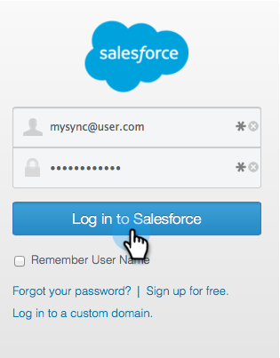
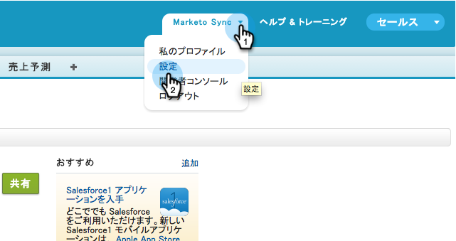

# Abilitare la sincronizzazione oggetti personalizzati non inglese {#enable-non-english-custom-object-sync}

Se l&#39;utente di Marketo Sync è impostato su una lingua diversa dall&#39;inglese, è possibile che si verifichi un errore quando si tenta di abilitare una sincronizzazione oggetto personalizzata.

## L&#39;errore {#the-error}

## Come aggirare il problema {#getting-around-it}

1. Accedere a [!DNL Salesforce] utilizzando l&#39;utente marketo sync.

   

1. Sotto il nome utente, vai a **[!UICONTROL Setup]**.

   

1. In **[!UICONTROL Personal Information]**, fare clic su **[!UICONTROL My Personal Information]**.

   

1. Fai clic su **[!UICONTROL Edit]**.

   

1. Cambia **[!UICONTROL Language]** in **[!UICONTROL English]**.

   

1. Fai clic su **[!UICONTROL Save]**.

   

1. In Marketo, in **[!UICONTROL Admin]** > **[!UICONTROL Salesforce]** > **[!UICONTROL Objects]**, fare clic su **[!UICONTROL Refresh Schema]**.

   

1. L&#39;elenco degli oggetti verrà richiamato in inglese. Selezionare l&#39;oggetto desiderato e fare clic su **[!UICONTROL Enable Sync]**.

   

1. Osserva che l’oggetto personalizzato è ora abilitato e sincronizzato.

   

1. Ora torna a [!DNL Salesforce] e utilizza i passaggi precedenti per ripristinare la lingua preferita dell&#39;utente di sincronizzazione.

>[!NOTE]
>
>Aggiorna lo schema un&#39;ultima volta per richiamare gli oggetti nella lingua.
