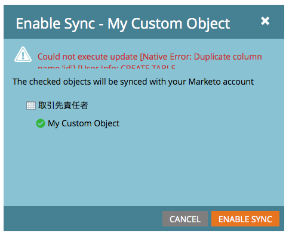

# Abilita sincronizzazione oggetti personalizzata non inglese {#enable-non-english-custom-object-sync}

Se l&#39;utente di sincronizzazione Marketo è impostato su una lingua diversa dall&#39;inglese, si può verificare un errore durante il tentativo di abilitare una sincronizzazione oggetto personalizzata.

## Errore {#the-error}

## Come aggirare il problema {#getting-around-it}

1. Accedi a Salesforce utilizzando il markto per sincronizzare l’utente.

   

1. Sotto il nome utente, vai a **Configurazione**.

   

1. In **Informazioni personali**, fai clic su **Informazioni personali**.

   

1. Fare clic su **Modifica**.

   

1. Cambia la **Lingua** in **Inglese**.

   

1. Fare clic su **Salva**.

   

1. In Marketo, in **Amministratore > Salesforce > Oggetti** fai clic su **Aggiorna schema**.

   

1. Questo estrae l’elenco degli oggetti in inglese. Ora seleziona l&#39;oggetto desiderato e fai clic su **Abilita sincronizzazione**.

   

1. Osserva che l’oggetto personalizzato è ora abilitato e sincronizzato.

   

1. Ora torna a Salesforce e utilizza i passaggi precedenti per ripristinare l’utente della sincronizzazione nella lingua preferita.

>[!NOTE]
>
>Non dimenticare di aggiornare lo schema un&#39;ultima volta per richiamare gli oggetti nella tua lingua.
