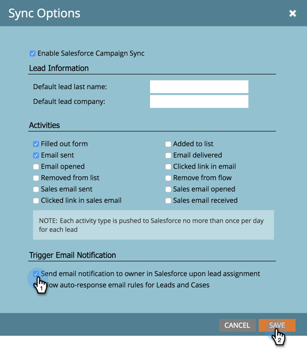

# Disattiva le notifiche e-mail al proprietario del lead {#turn-off-email-notifications-to-lead-owner}

Puoi disattivare le notifiche e-mail automatiche inviate ai Proprietari lead in Salesforce al momento dell’assegnazione del lead. Ecco come.

1. Vai a **Amministratore**.

   

1. Clic **Salesforce**.

   

1. Sotto **Opzioni di sincronizzazione**, fai clic su **Modifica**.

   

1. Deseleziona la **Invia una notifica e-mail al proprietario in Salesforce al momento dell’assegnazione del lead** casella. Clic **Salva**.

   
