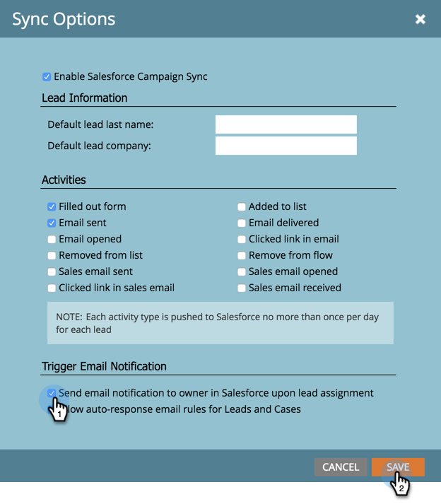

# Disattivare le notifiche e-mail al proprietario del lead {#turn-off-email-notifications-to-lead-owner}

È possibile disattivare le notifiche e-mail automatiche inviate ai Proprietari lead in [!DNL Salesforce] al momento dell&#39;assegnazione del lead. Ecco come.

1. Passa a **[!UICONTROL Admin]**.

   

1. Fai clic su **[!DNL Salesforce]**.

   

1. In **[!UICONTROL Sync Options]**, fare clic su **[!UICONTROL Edit]**.

   

1. Deselezionare la casella **[!UICONTROL Send email notification to owner in Salesforce upon lead assignment]**. Fai clic su **[!UICONTROL Save]**.

   
