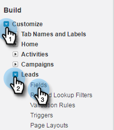

# Passaggio 1 di 3: Aggiungi campi Marketo a Salesforce (Professional) {#step-of-add-marketo-fields-to-salesforce-professional}

>[!PREREQUISITES]
>
>Per sincronizzare i dati tra Marketo e Salesforce, l’istanza Salesforce deve disporre dell’accesso alle API Salesforce.

Marketo utilizza un set di campi per acquisire alcuni tipi di informazioni relative al marketing. Se desideri questi dati in Salesforce, segui le istruzioni riportate di seguito.

1. Crea tre campi personalizzati in Salesforce sugli oggetti lead e contact : Punteggio, programma di acquisizione e data di acquisizione.
1. Mappa questi campi personalizzati tra lead e contatti in modo che, al momento della conversione in Salesforce, i valori vengano riportati.
1. Se necessario, puoi creare altri campi aggiuntivi (vedi la tabella seguente).

Tutti questi campi personalizzati sono facoltativi e non sono necessari per sincronizzare Marketo e Salesforce. È consigliabile creare campi per Punteggio, Programma di acquisizione e Data di acquisizione.

## Aggiungi campi Marketo a Salesforce {#add-marketo-fields-to-salesforce}

Aggiungi tre campi personalizzati sugli oggetti lead e contact in Salesforce elencati sopra. Per ulteriori informazioni, consulta la tabella dei campi disponibili alla fine di questa sezione.

Esegui i seguenti passaggi per ciascuno dei tre campi personalizzati per aggiungerli. Inizia con **Punteggio**.

1. Accedi a Salesforce e fai clic su **Configurazione.**

   

1. Nel menu Genera a sinistra, fai clic su **Personalizza** e seleziona **Lead**. Fai clic su **Campi**.

   

1. Fai clic su **Nuovo** nella sezione Campi personalizzati e relazioni nella parte inferiore della pagina.

   

1. Scegli il tipo di campo appropriato (per Punteggio — **numero**; Programma di acquisizione — **text**; Data acquisizione — **Data/ora**).

   

1. Fai clic su **Successivo**.

   

1. Immetti Etichetta campo, Lunghezza e Nome campo per il campo, come illustrato nella tabella seguente.

<table> 
 <thead> 
  <tr> 
   <th> 
    

      Etichetta campo 
    
</th> 
   <th> 
    

      Nome campo 
    
</th> 
   <th> 
    

      Tipo di dati 
    
</th> 
   <th> 
    

      Attributi del campo 
    
</th> 
  </tr> 
 </thead> 
 <tbody> 
  <tr> 
   <td>Punteggio</td> 
   <td>mkto71_Lead_Score</td> 
   <td>Numero</td> 
   <td>Lunghezza 10 Posizioni decimali 0 </td> 
  </tr> 
  <tr> 
   <td>Data di acquisizione</td> 
   <td>mkto71_Acquisition_Date</td> 
   <td>Data/ora</td> 
   <td> </td> 
  </tr> 
  <tr> 
   <td>Programma di acquisizione</td> 
   <td>mkto71_Acquisition_Program</td> 
   <td>Testo</td> 
   <td>Lunghezza 255</td> 
  </tr> 
 </tbody> 
</table>

>[!NOTE]
>
>Salesforce aggiunge __c ai nomi dei campi quando li utilizza per creare nomi API.

>[!NOTE]
>
>I campi testo e numero richiedono una lunghezza, ma non i campi data/ora. Una descrizione è facoltativa.

1. Fai clic su **Successivo**.

   

1. Specifica le impostazioni di accesso e fai clic su **Successivo**:

   * Imposta tutti i ruoli su **Visibile** e **Sola lettura**

   * Elimina **Sola lettura** per il profilo dell&#39;utente di sincronizzazione:

      * Se hai un utente con il profilo di un _Amministratore di sistema_ come utente di sincronizzazione, cancella il **Sola lettura** per il profilo amministratore di sistema (come mostrato di seguito)

      * Se hai creato un _profilo personalizzato_ per l&#39;utente di sincronizzazione, cancella il **Sola lettura** casella di controllo per il profilo personalizzato

   

1. Scegliere i layout di pagina da visualizzare nel campo.

   

1. Fai clic su **Salva e nuovo** per tornare indietro e creare ciascuno degli altri due campi personalizzati. Fai clic su **Salva** con voi avete finito con tutti e tre.

   

1. Nel menu Genera a sinistra, fai clic su **Personalizza** e seleziona **Contatti**. Fai clic su **Campi**.
1. Esegui i passaggi da 3 a 10 per i campi Punteggio, Data acquisizione e Programma di acquisizione sull’oggetto contatto, proprio come per l’oggetto lead.
1. Facoltativamente, utilizza la procedura precedente per tutti i campi personalizzati aggiuntivi di questa tabella.

<table> 
 <tbody> 
  <tr> 
   <th>Etichetta campo</th> 
   <th>Nome campo</th> 
   <th>Tipo di dati</th> 
   <th>Attributi del campo</th> 
  </tr> 
  <tr> 
   <td>ID del programma di acquisizione</td> 
   <td>mkto71_Acquisition_Program_Id</td> 
   <td>Numero</td> 
   <td>Lunghezza 18 Posizioni decimali 0 </td> 
  </tr> 
  <tr> 
   <td>Referrer originale</td> 
   <td>mkto71_Original_Referrer</td> 
   <td>Testo</td> 
   <td>Lunghezza 255</td> 
  </tr> 
  <tr> 
   <td>Motore di ricerca originale</td> 
   <td>mkto71_Original_Search_Engine</td> 
   <td>Testo</td> 
   <td>Lunghezza 255</td> 
  </tr> 
  <tr> 
   <td>Frase di ricerca originale</td> 
   <td>mkto71_Original_Search_Phrase</td> 
   <td>Testo</td> 
   <td>Lunghezza 255</td> 
  </tr> 
  <tr> 
   <td>Informazioni origine originali</td> 
   <td>mkto71_Original_Source_Info</td> 
   <td>Testo</td> 
   <td>Lunghezza 255</td> 
  </tr> 
  <tr> 
   <td>Tipo di origine originale</td> 
   <td>mkto71_Original_Source_Type</td> 
   <td>Testo</td> 
   <td>Lunghezza 255</td> 
  </tr> 
  <tr> 
   <td>Città dedotta</td> 
   <td>mkto71_Inferred_City</td> 
   <td>Testo</td> 
   <td>Lunghezza 255</td> 
  </tr> 
  <tr> 
   <td>Azienda dedotta</td> 
   <td>mkto71_Inferred_Company</td> 
   <td>Testo</td> 
   <td>Lunghezza 255</td> 
  </tr> 
  <tr> 
   <td>Paese dedotto</td> 
   <td>mkto71_Inferred_Country</td> 
   <td>Testo</td> 
   <td>Lunghezza 255</td> 
  </tr> 
  <tr> 
   <td>oArea metropolitana in oggetto</td> 
   <td>mkto71_Inferred_Metropolitan_Area</td> 
   <td>Testo</td> 
   <td>Lunghezza 255</td> 
  </tr> 
  <tr> 
   <td>Prefisso telefonico in oggetto</td> 
   <td>mkto71_Inferred_Phone_Area_Code</td> 
   <td>Testo</td> 
   <td>Lunghezza 255</td> 
  </tr> 
  <tr> 
   <td>Codice postale in oggetto</td> 
   <td>mkto71_Inferred_Postal_Code</td> 
   <td>Testo</td> 
   <td>Lunghezza 255</td> 
  </tr> 
  <tr> 
   <td>Stato in oggetto</td> 
   <td>mkto71_Inferred_State_Region</td> 
   <td>Testo</td> 
   <td>Lunghezza 255</td> 
  </tr> 
 </tbody> 
</table>

>[!NOTE]
>
>I valori nei campi assegnati automaticamente da Marketo non saranno immediatamente disponibili in Salesforce al momento della creazione del nuovo campo. Marketo sincronizzerà i dati con Salesforce al successivo aggiornamento del record su entrambi i sistemi (ovvero, un aggiornamento a uno qualsiasi dei campi sincronizzati tra Marketo e Salesforce).

## Mappa campi personalizzati per le conversioni  {#map-custom-fields-for-conversions}

Un campo personalizzato sull’oggetto lead di Salesforce deve essere mappato su un campo contatto dell’oggetto contatto in modo che i dati vengano trasferiti quando si verifica una conversione.

1. Nell&#39;angolo in alto a destra, fare clic su Configurazione.

   

1. Digitare &quot;fields&quot; nella ricerca di navigazione senza premere invio. I campi sono visualizzati sotto oggetti diversi; Fare clic su Campi in Lead.

   

1. Vai alla sezione Campi personalizzati lead e relazioni e fai clic su Mappa campi lead .

   

1. Fai clic sull’elenco a discesa accanto al campo da mappare.

   

1. Seleziona il campo personalizzato del contatto corrispondente.

   

1. Ripeti i passaggi precedenti per tutti gli altri campi creati.

1. Al termine, fai clic su Salva .

Abbastanza facile, vero?

>[!MORELIKETHIS]
>
>[Passaggio 2 di 3: Creare un utente Salesforce per Marketo (Professional)](/help/marketo/product-docs/crm-sync/salesforce-sync/setup/professional-edition/step-2-of-3-create-a-salesforce-user-for-marketo-professional.md)
