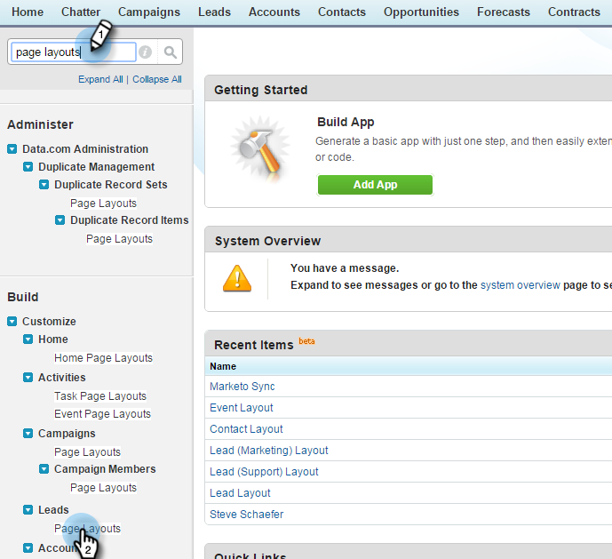

# Passaggio 2 di 3: Creare un utente Salesforce per Marketo (Professional) {#step-of-create-a-salesforce-user-for-marketo-professional}

>[!NOTE]
>
>Questi passaggi devono essere completati da un amministratore Salesforce

>[!PREREQUISITES]
>
>[Passaggio 1 di 3: Aggiungi campi Marketo a Salesforce (Professional)](/help/marketo/product-docs/crm-sync/salesforce-sync/setup/professional-edition/step-1-of-3-add-marketo-fields-to-salesforce-professional.md)

In questo articolo, personalizzerai le autorizzazioni del campo con un layout di pagina Salesforce e creerai un utente di sincronizzazione Marketo-Salesforce.

## Imposta layout di pagina {#set-page-layouts}

Salesforce Professional imposta l&#39;accessibilità a livello di campo con i layout di pagina, rispetto ai profili di Salesforce Enterprise/Unlimited. Seguendo questi passaggi l’utente della sincronizzazione Marketo potrà aggiornare i campi personalizzati.

1. Digita **layout di pagina** nella barra di ricerca della barra di navigazione senza premere **Invio** e fai clic su **Layout di pagina** in **Lead**.

   

1. Fate clic su **Modifica** accanto a Layout lead.

   

1. Fai clic su e trascina un nuovo elemento **Sezione** nel layout di pagina.

   

1. Immettere &quot;Marketo&quot; per **Nome sezione** e fare clic su **OK**.

   

1. Fai clic e trascina il campo **Data acquisizione** nella sezione **Marketo** .

   

1. Ripeti il passaggio precedente per i campi seguenti:

   * Programma di acquisizione
   * ID del programma di acquisizione
   * Rifiuto e-mail
   * Città di riferimento
   * Azienda in oggetto
   * Paese in oggetto
   * Area metropolitana
   * Codice di area del telefono
   * Codice postale trasferito
   * Regione dello Stato di provenienza
   * Punteggio Lead
   * Referrer originale
   * Motore di ricerca originale
   * Frase di ricerca originale
   * Informazioni origine originali
   * Tipo di origine originale

   >[!NOTE]
   >
   >Questi campi devono trovarsi nel layout di pagina in modo che Marketo possa leggerli o scriverli.

   >[!TIP]
   >
   >Crea due colonne per i campi trascinando verso il basso sul lato destro della pagina. È possibile spostare i campi da un lato all’altro per bilanciare le lunghezze delle colonne.

1. Al termine, fai clic su **Salva** .

   

1. Ripeti tutti i passaggi precedenti per Salesforce **Layout pagina di contatto**.

   

1. Ricorda di fare clic su **Salva** quando hai finito con **Contatta layout pagina**.

   

   >[!NOTE]
   >
   >Assicurati che il campo **All-Day Event** sia stato aggiunto al **layout pagina evento**.

## Crea sincronizzazione utente {#create-sync-user}

Marketo richiede le credenziali per accedere a Salesforce. È meglio eseguire questa operazione con un utente dedicato creato con i passaggi seguenti.

>[!NOTE]
>
>Se la tua organizzazione non dispone di licenze Salesforce aggiuntive, puoi utilizzare un **utente Marketing** esistente con il profilo **Amministratore di sistema**.

1. Inserisci &quot;utenti&quot; nella barra di ricerca della barra di navigazione e fai clic su **Utenti** in **Gestisci utenti**.

   

1. Fare clic su **Nuovo utente**.

   

1. Compila i campi obbligatori, seleziona la **Licenza utente: Salesforce**, imposta il **Profilo: Amministratore di sistema**, controlla **Marketing User** e fai clic su **Salva**.

   

   >[!TIP]
   >
   >Assicurati che l&#39;indirizzo e-mail immesso sia valido. Per reimpostare la password dovrai accedere come utente di sincronizzazione.

Eccellente! Ora disponi di un account che Marketo può utilizzare per connettersi a Salesforce. Facciamolo.

>[!MORELIKETHIS]
>
>[Passaggio 3 di 3: Collegare Marketo e Salesforce (Professional)](/help/marketo/product-docs/crm-sync/salesforce-sync/setup/professional-edition/step-3-of-3-connect-marketo-and-salesforce-professional.md)
