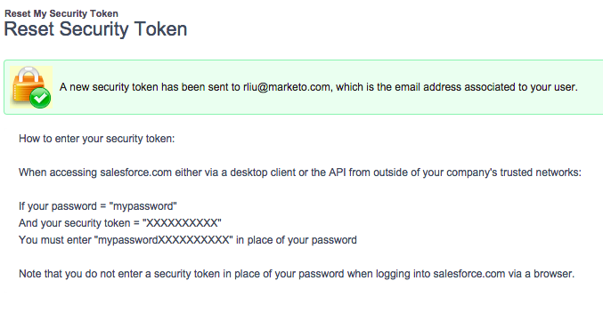
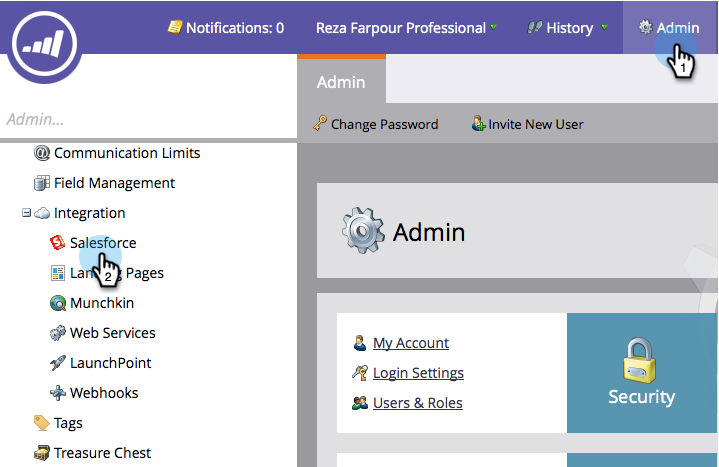
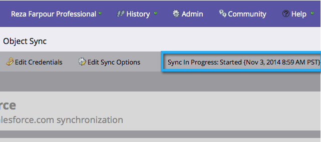

# Passaggio 3 di 3: connettere Marketo e [!DNL Salesforce] (Professional) {#step-of-connect-marketo-and-salesforce-professional}

In questo articolo configurerai Marketo Engage per la sincronizzazione con l’istanza di Salesforce configurata.

>[!PREREQUISITES]
>
>* [Passaggio 1 di 3: aggiunta di campi Marketo a Salesforce (Professional)](/help/marketo/product-docs/crm-sync/salesforce-sync/setup/professional-edition/step-1-of-3-add-marketo-fields-to-salesforce-professional.md){target="_blank"}
>* [Passaggio 2 di 3: creazione di un utente Salesforce per Marketo (Professional)](/help/marketo/product-docs/crm-sync/salesforce-sync/setup/professional-edition/step-2-of-3-create-a-salesforce-user-for-marketo-professional.md){target="_blank"}

## Recupera token di sicurezza utente di sincronizzazione {#retrieve-sync-user-security-token}

>[!TIP]
>
>Se disponi già del token di sicurezza, passa direttamente a Imposta credenziali utente e kudo di sincronizzazione per la preparazione.

1. Accedere a Salesforce con l&#39;utente Marketo Sync, fare clic sul nome dell&#39;utente Sync, quindi **[!UICONTROL My Settings]**.

   

1. Nella barra di ricerca di navigazione, digitare &quot;reset&quot; e fare clic su **[!UICONTROL Reset My Security Token]**.

   

1. Fai clic su **[!UICONTROL Reset Security Token]**.

   

   Il token di sicurezza ti verrà inviato via e-mail.

## Imposta credenziali utente di sincronizzazione {#set-sync-user-credentials}

1. In Marketo, vai a **[!UICONTROL Admin]**, seleziona **[!UICONTROL CRM]** e fai clic su **[!UICONTROL Sync with Salesforce.com]**.

   

   >[!NOTE]
   >
   >Assicurarsi di [nascondere tutti i campi non necessari](/help/marketo/product-docs/crm-sync/salesforce-sync/sfdc-sync-details/hide-a-salesforce-field-from-the-marketo-sync.md){target="_blank"} in Marketo dall&#39;utente sincronizzato prima di fare clic su **[!UICONTROL Sync Fields]**. Dopo aver fatto clic su Sincronizza campi, tutti i campi visualizzati dall&#39;utente verranno creati in Marketo in modo permanente e non potranno essere eliminati.

1. Immettere le credenziali utente di Salesforce Sync create nella parte 2 della configurazione di Salesforce ([Professional](/help/marketo/product-docs/crm-sync/salesforce-sync/setup/professional-edition/step-2-of-3-create-a-salesforce-user-for-marketo-professional.md), [Enterprise](/help/marketo/product-docs/crm-sync/salesforce-sync/setup/enterprise-unlimited-edition/step-2-of-3-create-a-salesforce-user-for-marketo-enterprise-unlimited.md)) e fare clic su **[!UICONTROL Sync Fields]**.

   

   >[!NOTE]
   >
   >Seleziona **[!UICONTROL Sandbox]** se stai sincronizzando una sandbox di Marketo in una sandbox di Salesforce.

1. Leggere l&#39;avviso, quindi fare clic su **[!UICONTROL Confirm Credentials]**.

   

   >[!CAUTION]
   >
   >Se vuoi controllare le [mappature e personalizzarle](/help/marketo/product-docs/crm-sync/salesforce-sync/setup/optional-steps/edit-initial-field-mappings.md){target="_blank"}, questa è la tua unica possibilità! Dopo aver fatto clic su Avvia Salesforce Sync, l&#39;operazione viene completata.

## Avvia sincronizzazione [!DNL Salesforce] {#start-salesforce-sync}

1. Fare clic su **[!UICONTROL Start Salesforce Sync]** per avviare la sincronizzazione persistente Marketo-Salesforce.

   

   >[!CAUTION]
   >
   >Marketo non eseguirà la deduplicazione automatica in base a una sincronizzazione [!DNL Salesforce] o quando si immettono manualmente i lead.

1. Fai clic su **[!UICONTROL Start Sync]**.

   

   >[!NOTE]
   >
   >Il tempo necessario per completare la sincronizzazione iniziale varia a seconda delle dimensioni e della complessità del database.

## Verifica sincronizzazione {#verify-sync}

Marketo fornisce messaggi di stato per la sincronizzazione [!DNL Salesforce] nell&#39;area di amministrazione. Per verificare che la sincronizzazione funzioni correttamente, segui la procedura riportata di seguito.

1. In Marketo, fai clic su **[!UICONTROL Admin]**, quindi su **Salesforce**.

   

1. Lo stato di sincronizzazione è visibile nell&#39;angolo superiore destro. Verrà visualizzato uno dei tre messaggi seguenti: **[!UICONTROL Last Synced]**, **[!UICONTROL Sync in Progress]** o **[!UICONTROL Failed]**.

   

   

   

Hai appena finito di configurare una delle funzionalità più potenti di Marketo, vai!

>[!MORELIKETHIS]
>
>* [Installa il pacchetto Marketo Sales Insight in Salesforce AppExchange](/help/marketo/product-docs/marketo-sales-insight/msi-for-salesforce/installation/install-marketo-sales-insight-package-in-salesforce-appexchange.md){target="_blank"}
>* [Configurare Marketo Sales Insight in Salesforce Professional Edition](/help/marketo/product-docs/marketo-sales-insight/msi-for-salesforce/configuration/configure-marketo-sales-insight-in-salesforce-professional-edition.md){target="_blank"}
