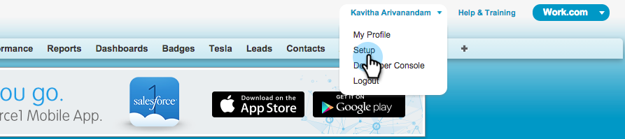

# Aggiungi un campo Salesforce esistente a Marketo Sync {#add-an-existing-salesforce-field-to-the-marketo-sync}

>[!NOTE]
>
>**Autorizzazioni amministratore richieste**

In genere, i nuovi campi personalizzati in Salesforce vengono sincronizzati automaticamente con Marketo. In caso contrario, i campi potrebbero non essere visibili all&#39;utente di Marketo Sync. Ecco come si può risolvere il problema.

1. Fai clic sul tuo nome e seleziona **Configurazione**.

   

1. Invio **profilo** nella barra di ricerca a sinistra e fai clic su **Profili** in **Gestisci utenti**.

   

1. Fai clic sul profilo dell’utente di sincronizzazione.

   

1. Sotto **Sicurezza a livello di campo** , fare clic su **Visualizza** accanto all&#39;oggetto che contiene il campo.

   

1. Clic **Modifica**.

   

1. Controlla la **Visibile** casella di controllo per il campo da aggiungere alla sincronizzazione e fare clic su **Salva**.

   

   Dolce! Al prossimo ciclo di sincronizzazione, Marketo visualizzerà il campo e avvierà la magia.

   >[!NOTE]
   >
   > Se il campo contiene già dei valori in Salesforce, questi non vengono sincronizzati con Marketo fino al successivo aggiornamento del record.
