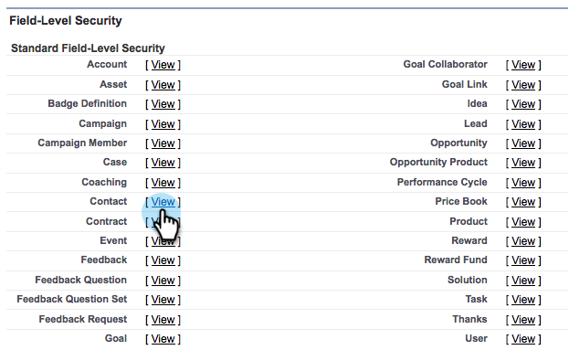

# Nascondere un campo Salesforce dalla sincronizzazione Marketo {#hide-a-salesforce-field-from-the-marketo-sync}

>[!NOTE]
>
>**Autorizzazioni amministratore richieste**

Non tutti i campi di Salesforce sono utili per il marketing. Puoi ottimizzare le prestazioni di sincronizzazione includendo solo i campi necessari. Ecco come nascondere un campo da Marketo.

1. Fai clic sul menu del nome e seleziona **Configurazione**.

   

1. Invio **profiles** nella barra di ricerca e fai clic su **Profili** sotto **Gestione utenti**.

   

1. Fai clic sul profilo dell’utente di sincronizzazione.

   

1. Sotto la **Sicurezza a livello di campo** sezione, fai clic su **Visualizza** accanto all’oggetto contenente il campo di destinazione.

   

1. Fai clic su **Modifica**.

   

1. Deseleziona **Visibile** selezionare la casella di controllo accanto al campo che si desidera nascondere. Fai clic su **Salva**.

   

   >[!NOTE]
   >
   >Se il campo nascosto in Salesforce è già stato sincronizzato con Marketo, dovrai nasconderlo anche in Marketo, se non lo desideri.

   Tutto qui! Questo campo non verrà più visualizzato in Marketo al termine della sincronizzazione successiva.

   >[!MORELIKETHIS]
   >
   >[Nascondere e visualizzare un campo](/help/marketo/product-docs/administration/field-management/hide-and-unhide-a-field.md)
