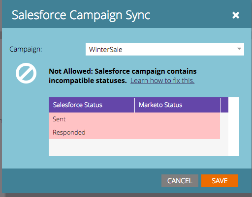

# Come abbinare gli stati del programma e gli stati [!DNL Salesforce] delle campagne prima della sincronizzazione {#how-to-match-program-statuses-and-salesforce-campaign-statuses-prior-to-sync}

In questo articolo viene descritto come correggere un errore di stato incompatibile e mappare gli stati prima della sincronizzazione del programma Marketo e di [!DNL Salesforce] Campaign.

## Cosa fare se si riceve un messaggio di errore {#what-do-you-do-if-you-received-an-error-message}

Se si tenta di eseguire la sincronizzazione con una campagna [!DNL Salesforce] esistente contenente lead e la campagna contiene uno o più stati incompatibili, viene visualizzato un messaggio di errore. Un programma Marketo e una campagna [!DNL Salesforce] *non verranno sincronizzati* se gli stati non corrispondono esattamente.

Da questo messaggio di errore, puoi scegliere di:

1. Seleziona un’altra campagna da sincronizzare dal menu a discesa, OPPURE
1. È possibile annullare l&#39;operazione, correggere gli errori di stato e provare a eseguire la sincronizzazione una volta corretti gli errori. Per correggere gli errori di stato, effettuare una delle seguenti operazioni:

   * Accedi a Salesforce e rimuovi o rinomina gli Stati membri della campagna incompatibili per eseguire il mapping agli stati del programma Marketo utilizzati per il tipo di canale associato al programma Marketo.
   * Modifica gli stati del programma in Marketo per mappare gli stati membri di Salesforce Campaign che hai impostato. Questa è una funzione di amministrazione di Marketo. Per ulteriori dettagli, vedere [Creare un canale del programma](/help/marketo/product-docs/administration/tags/create-a-program-channel.md){target="_blank"}.
