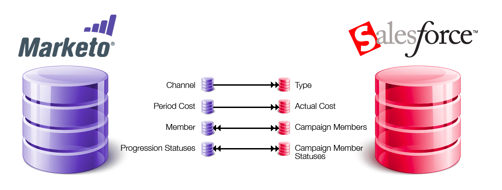

# Sincr. SFDC: Sincronizzazione campagna {#sfdc-sync-campaign-sync}

I programmi Marketo possono essere sincronizzati con le campagne Salesforce. Di seguito viene fornita una panoramica di come funziona.

## Perché dovrei sincronizzare i programmi Marketo con le campagne Salesforce? {#why-should-i-sync-marketo-programs-with-salesforce-campaigns}

* Utilizza le potenti funzionalità di un programma Marketo.
* Mantieni i membri e il loro stato sincronizzati tra un programma Marketo e una campagna Salesforce.
* Toccate le funzioni di reporting in Marketo e Salesforce.

## Come vengono sincronizzati un programma Marketo e una campagna Salesforce? {#how-is-a-marketo-program-and-a-salesforce-campaign-synced}

In Marketo, puoi creare una mappatura uno-a-uno tra un programma e una campagna Salesforce.

I **[canali](/help/marketo/product-docs/administration/tags/create-a-program-channel.md)** e **[costi di periodo](/help/marketo/product-docs/core-marketo-concepts/programs/working-with-programs/understanding-period-costs.md)** in Marketo sincronizzano con Salesforce come **tipo di campagna** e **costo effettivo**. Questa sincronizzazione è **unidirezionale**, da Marketo a Salesforce.

I membri del programma **Marketo** e i relativi stati di progressione **** sono sincronizzati con i membri della campagna **Salesforce** e **stati membri della campagna**. Si tratta di una **sincronizzazione bidirezionale**, pertanto tutte le modifiche apportate in Marketo o Salesforce si riflettono in entrambi i sistemi.

>[!NOTE]
>
>Se nel programma Marketo sono presenti membri che non esistono in Salesforce, Marketo li crea come lead in Salesforce.

## Quali sono i trigger/filtri correlati alle campagne? {#what-are-the-triggers-filters-related-to-campaigns}

Triggers:

* Aggiunta alla campagna SFDC
* Rimosso dalla campagna SFDC
* Lo stato viene modificato nella campagna SFDC

Filtri:

* Membro della campagna SFDC

## Posso aggiungere Marketo People alla mia campagna SFDC? {#can-i-add-marketo-people-to-my-sfdc-campaign}

Sì, utilizzare l&#39;azione di flusso della campagna [Aggiungi a SFDC](/help/marketo/product-docs/core-marketo-concepts/smart-campaigns/salesforce-flow-actions/add-to-sfdc-campaign.md). Se questa persona non esiste in Salesforce, Marketo la creerà in Salesforce e quindi lo aggiungerà alla campagna.

## È possibile rimuovere i membri dalla campagna SFDC utilizzando Marketo? {#can-i-remove-members-from-my-sfdc-campaign-using-marketo}

Sì, utilizza l&#39;azione di flusso [Rimuovi da SFDC Campaign](/help/marketo/product-docs/core-marketo-concepts/smart-campaigns/salesforce-flow-actions/remove-from-sfdc-campaign.md).

## Posso cambiare lo stato dei membri della campagna utilizzando Marketo? {#can-i-change-campaign-member-status-using-marketo}

Sì, utilizza l&#39; [Modifica stato in azione flusso campagna SFDC](/help/marketo/product-docs/core-marketo-concepts/smart-campaigns/salesforce-flow-actions/change-status-in-sfdc-campaign.md).

## Perché non riesco a vedere nessuna delle mie campagne Salesforce? {#why-cant-i-see-any-of-my-salesforce-campaigns}

Di seguito sono riportati alcuni elementi che è possibile controllare:

1. Assicuratevi che la sincronizzazione delle [campagne sia abilitata](/help/marketo/product-docs/crm-sync/salesforce-sync/setup/optional-steps/enable-disable-campaign-sync.md).
1. Confermate che la [sincronizzazione di marketing utente](/help/marketo/product-docs/crm-sync/salesforce-sync/setup/enterprise-unlimited-edition/step-2-of-3-create-a-salesforce-user-for-marketo-enterprise-unlimited.md) sia un [utente di marketing](/help/marketo/product-docs/crm-sync/salesforce-sync/setup/optional-steps/enable-disable-campaign-sync/make-marketo-sync-user-a-marketing-user.md) in Salesforce.

>[!NOTE]
>
>Se la tua campagna Salesforce e il programma Marketo mappato hanno stati di programma incompatibili, potresti ricevere un messaggio di errore. È consigliabile che [gli stati del programma corrispondano prima della sincronizzazione](/help/marketo/product-docs/crm-sync/salesforce-sync/sfdc-sync-details/sfdc-errors/how-to-match-program-statuses-and-salesforce-campaign-statuses-prior-to-sync.md).

>[!MORELIKETHIS]
>
>* [Sincronizzazione di una campagna SFDC con un programma](/help/marketo/product-docs/core-marketo-concepts/programs/working-with-programs/sync-an-sfdc-campaign-with-a-program.md)
>* [Informazioni sull&#39;iscrizione al programma](/help/marketo/product-docs/core-marketo-concepts/programs/creating-programs/understanding-program-membership.md)
>* [Attiva/Disattiva sincronizzazione campagna](/help/marketo/product-docs/crm-sync/salesforce-sync/setup/optional-steps/enable-disable-campaign-sync.md)
>* [Come rendere Marketo Sync User un Marketing User](/help/marketo/product-docs/crm-sync/salesforce-sync/setup/optional-steps/enable-disable-campaign-sync/make-marketo-sync-user-a-marketing-user.md)

