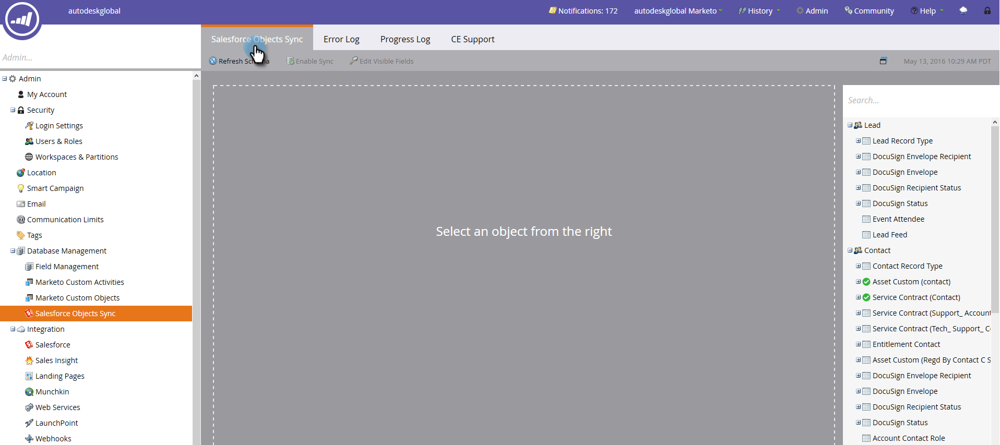

# Sincronizzazione SFDC: Sincronizzazione oggetto personalizzata {#sfdc-sync-custom-object-sync}

Anche gli oggetti personalizzati creati nell’istanza Salesforce possono far parte di Marketo.  Ecco come configurarlo.

>[!NOTE]
>
>**Autorizzazioni amministratore richieste**

>[!PREREQUISITES]
>
>Per utilizzare un oggetto personalizzato, è necessario associarlo a un [lead](/help/marketo/product-docs/crm-sync/salesforce-sync/sfdc-sync-details/sfdc-sync-field-sync.md), [contatto](/help/marketo/product-docs/crm-sync/salesforce-sync/sfdc-sync-details/sfdc-sync-contact-sync.md), o [account](/help/marketo/product-docs/crm-sync/salesforce-sync/sfdc-sync-details/sfdc-sync-account-sync.md) oggetto in Salesforce.

>[!IMPORTANT]
>
>L&#39;utente di Marketo Sync ha bisogno dell&#39;accesso in lettura all&#39;oggetto personalizzato per elencarlo ed eseguire una sincronizzazione.

## Abilita oggetto personalizzato  {#enable-custom-object}

1. Clic **Amministratore** e **Sincronizzazione oggetti Salesforce** collegamento.

   .

1. Se si tratta del primo oggetto personalizzato, fare clic su **Schema di sincronizzazione**.

   

1. Clic **Disattiva sincronizzazione globale**.

   

   >[!NOTE]
   >
   >Una sincronizzazione iniziale dello schema di oggetti personalizzato di Salesforce potrebbe richiedere alcuni minuti.

   

1. Trascina nell’area di lavoro l’oggetto personalizzato da sincronizzare.

   

   >[!NOTE]
   >
   >Gli oggetti personalizzati devono avere nomi univoci. Marketo non supporta due oggetti personalizzati diversi con lo stesso nome.

1. Clic **Abilita sincronizzazione**.

   

1. Clic **Abilita sincronizzazione** di nuovo.

   

   >[!NOTE]
   >
   >Non dimenticare di riattivare la sincronizzazione globale.

1. Torna a **Salesforce** scheda.

   

1. Clic **Abilita sincronizzazione**.

   

1. Per visualizzare tutti gli oggetti personalizzati di Salesforce, fai clic su **Amministratore** e **Sincronizzazione oggetti Salesforce** (come nel precedente passaggio 1).

   

   >[!NOTE]
   >
   >Marketo supporta solo entità personalizzate collegate a entità standard profonde uno o due livelli.

### Passaggio successivo: {#whats-next}

[Aggiungi/Rimuovi campo oggetto personalizzato come vincoli di elenco avanzato/trigger](/help/marketo/product-docs/crm-sync/salesforce-sync/setup/optional-steps/add-remove-custom-object-field-as-smart-list-trigger-constraints.md)

Eccellente! Ora puoi utilizzare i dati di questo oggetto personalizzato nelle campagne avanzate e negli elenchi avanzati.
