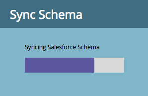
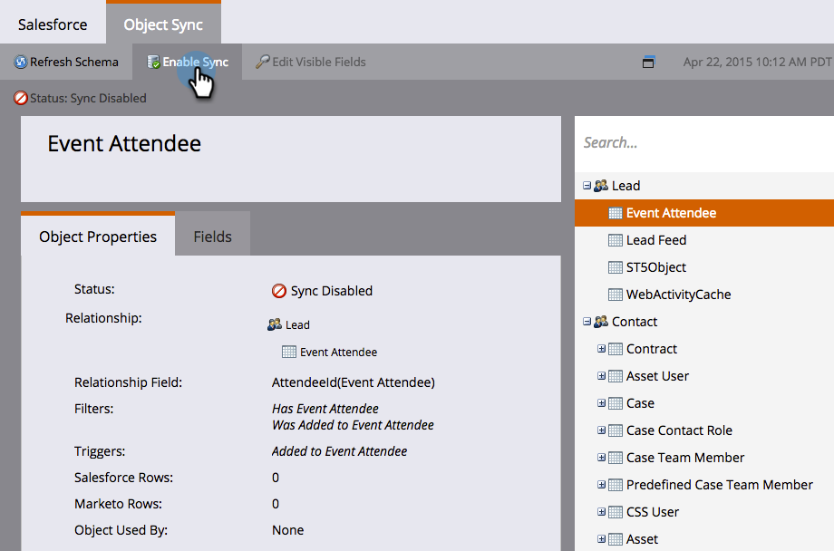

# Sincronizzazione SFDC: sincronizzazione oggetto personalizzato {#sfdc-sync-custom-object-sync}

Anche gli oggetti personalizzati creati nell&#39;istanza [!DNL Salesforce] possono far parte di Marketo.  Ecco come configurarlo.

>[!NOTE]
>
>**Autorizzazioni amministratore richieste**

>[!PREREQUISITES]
>
>Per utilizzare un oggetto personalizzato, è necessario associarlo a un oggetto [lead](/help/marketo/product-docs/crm-sync/salesforce-sync/sfdc-sync-details/sfdc-sync-field-sync.md), [contact](/help/marketo/product-docs/crm-sync/salesforce-sync/sfdc-sync-details/sfdc-sync-contact-sync.md) o [account](/help/marketo/product-docs/crm-sync/salesforce-sync/sfdc-sync-details/sfdc-sync-account-sync.md) in [!DNL Salesforce].

>[!IMPORTANT]
>
>L&#39;utente di Marketo Sync ha bisogno dell&#39;accesso in lettura all&#39;oggetto personalizzato per elencarlo ed eseguire una sincronizzazione.

## Abilita oggetto personalizzato  {#enable-custom-object}

1. Fare clic su **[!UICONTROL Admin]** e sul collegamento **[!UICONTROL Salesforce Objects Sync]**.

   .

1. Se si tratta del primo oggetto personalizzato, fare clic su **[!UICONTROL Sync Schema]**.

   

1. Fai clic su **[!UICONTROL Disable Global Sync]**.

   

   >[!NOTE]
   >
   >La sincronizzazione iniziale dello schema di oggetti personalizzato [!DNL Salesforce] potrebbe richiedere alcuni minuti.

   

1. Trascina nell’area di lavoro l’oggetto personalizzato da sincronizzare.

   

   >[!NOTE]
   >
   >Gli oggetti personalizzati devono avere nomi univoci. Marketo non supporta due oggetti personalizzati diversi con lo stesso nome.

1. Fai clic su **[!UICONTROL Enable Sync]**.

   

1. Fare di nuovo clic su **[!UICONTROL Enable Sync]**.

   

   >[!NOTE]
   >
   >Ricordati di riattivare la sincronizzazione globale.

1. Torna alla scheda **[!UICONTROL Salesforce]**.

   

1. Fai clic su **[!UICONTROL Enable Sync]**.

   

1. Per visualizzare tutti gli oggetti personalizzati di [!DNL Salesforce], fare clic su **[!UICONTROL Admin]** e sul collegamento **[!UICONTROL Salesforce Objects Sync]** (come nel passaggio 1 precedente).

   

   >[!NOTE]
   >
   >* Marketo supporta solo entità personalizzate collegate a entità standard profonde uno o due livelli.
   >
   >* La struttura ad oggetti personalizzata può mostrare lo stesso oggetto più di una volta, a causa delle sue connessioni dirette con uno degli oggetti principali (ad esempio lead, contatti o account o connessioni indirette attraverso un oggetto intermedio). In questi casi, scegliere l&#39;oggetto più vicino all&#39;oggetto principale e sceglierne solo uno. La scelta dello stesso oggetto più volte può ostacolare la sincronizzazione dell&#39;oggetto personalizzato.

### Passaggio successivo: {#whats-next}

[Aggiungere/rimuovere campo oggetto personalizzato come vincoli di elenco avanzato/trigger](/help/marketo/product-docs/crm-sync/salesforce-sync/setup/optional-steps/add-remove-custom-object-field-as-smart-list-trigger-constraints.md){target="_blank"}

Ora puoi utilizzare i dati di questo oggetto personalizzato nelle campagne avanzate e negli elenchi avanzati.
