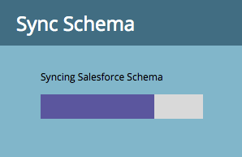

# Sincr. SFDC: Sincronizzazione oggetti personalizzata {#sfdc-sync-custom-object-sync}

Anche gli oggetti personalizzati creati nell’istanza Salesforce possono far parte di Marketo.  Ecco come impostarlo.

>[!NOTE]
>
>**Autorizzazioni amministratore richieste**

>[!PREREQUISITES]
>
>Per utilizzare un oggetto personalizzato, deve essere associato a un oggetto [lead](sfdc-sync-lead-sync.md), contactor accountobject in Salesforce.

## Abilita oggetto personalizzato  {#enable-custom-object}

1. Fai clic su **Admin** e sul **collegamento** di sincronizzazione** degli oggetti Salesforce.**

   .

1. Se si tratta del primo oggetto personalizzato, fare clic su **Sincronizza schema.**

   

1. Fate clic su **Disattiva sincronizzazione globale.**

   

   >[!NOTE]
   >
   >La sincronizzazione iniziale dello schema oggetto personalizzato di Salesforce potrebbe richiedere alcuni minuti.

   

1. Trascinate l’oggetto personalizzato da sincronizzare nel quadro.

   

   >[!NOTE]
   >
   >Gli oggetti personalizzati devono avere nomi univoci. Marketo non supporta due diversi oggetti personalizzati con lo stesso nome.

1. Fate clic su **Abilita sincronizzazione.**

   

1. Fate di nuovo clic su **Abilita sincronizzazione** .

   

   >[!NOTE]
   >
   >**Promemoria**
   >
   >
   >Non dimenticare di riabilitare la sincronizzazione globale!

1. Tornare alla **Salesforce **tab.

   

1. Fate clic su **Abilita sincronizzazione.**

   

1. Per visualizzare tutti gli oggetti personalizzati Salesforce, fai clic su **Admin** e sul collegamento** Salesforce Objects Sync **link (come nel passaggio 1 precedente).

   

   >[!NOTE]
   >
   >Marketo supporta solo entità personalizzate collegate a entità standard con uno o due livelli di profondità.

### Ulteriori informazioni: {#whats-next}

[Aggiungi/rimuovi campo oggetto personalizzato come vincolo di elenco avanzato/trigger](../../../../product-docs/crm-sync/salesforce-sync/setup/optional-steps/add-remove-custom-object-field-as-smart-list-trigger-constraints.md)

Eccellente! È ora possibile utilizzare i dati di questo oggetto personalizzato in campagne smart ed elenchi smart.

