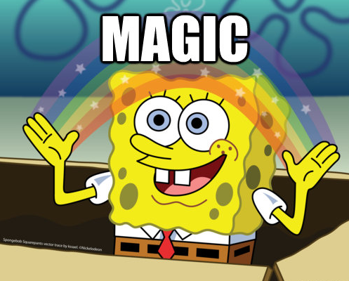

# Sincr. SFDC: Eliminazione di un lead/contatto {#sfdc-sync-deleting-a-lead-contact}

>[!NOTE]
>
>**FYI**
>
>Marketo sta standardizzando la lingua tra tutte le iscrizioni, pertanto è possibile che nell&#39;abbonamento siano presenti lead/lead e persone in docs.marketo.com. Questi termini significano la stessa cosa; non influisce sulle istruzioni dell&#39;articolo. Ci sono anche altri cambiamenti. [Ulteriori](http://docs.marketo.com/display/DOCS/Updates+to+Marketo+Terminology)informazioni.

Di seguito sono riportati alcuni dettagli:

* Marketo non elimina automaticamente le persone solo perché i lead sono stati eliminati in Salesforce. Piuttosto, il flag &quot;SFDC Is Deleted&quot; del campo è impostato su true. Se lo desideri, puoi disattivare questo campo per eliminarlo in Marketo.
* [Elimina azione flusso persona](../../../../product-docs/core-marketo-concepts/smart-campaigns/flow-actions/delete-person.md) . In questo modo viene eliminata una persona in MKTO, ma è possibile eliminare `Salesforce` anche la persona.

* [Elimina da azione flusso SFDC](../../../../product-docs/core-marketo-concepts/smart-campaigns/salesforce-flow-actions/delete-person-from-sfdc.md) : In questo modo si elimina un lead in SFDC, ma si può anche scegliere di eliminarlo in Marketo.
* Se un lead viene eliminato in Salesforce (ma una persona non viene eliminata in Marketo) e successivamente viene eseguito tramite l’azione [Sincronizza con flusso Salesforce](../../../../product-docs/core-marketo-concepts/smart-campaigns/salesforce-flow-actions/sync-person-to-sfdc.md) , verrà creato un nuovo lead in Salesforce.

In altre parole, funziona come la magia!

