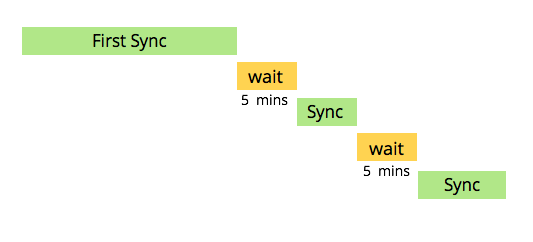

# Informazioni sulla sincronizzazione con [!DNL Salesforce] {#understanding-the-salesforce-sync}

Marketo Engage e Salesforce si completano alla perfezione. Mantengono la sincronizzazione dei dati di vendita e di marketing.

## Funzionamento della sincronizzazione {#how-sync-works}

Marketo esegue la sincronizzazione con [!DNL Salesforce] in modo costante. Ciascuna sincronizzazione richiede un po’ di tempo, viene messa in pausa per 5 minuti e quindi riavviata.

>[!NOTE]
>
>La prima sincronizzazione dell’abbonamento potrebbe richiedere ore o persino giorni perché Marketo copia l’intero database da [!DNL Salesforce]. In seguito, ciascuna sincronizzazione richiede in genere pochi secondi o minuti e vengono sincronizzati solo i dati modificati.

La sincronizzazione tra [!DNL Salesforce] e Marketo è bidirezionale solo per i lead, i contatti e le campagne di [!DNL Salesforce]. In questi casi, ogni volta che apporti modifiche in [!DNL Salesforce] o Marketo, gli aggiornamenti si rifletteranno su entrambi i sistemi. Tutte le altre sincronizzazioni avvengono solo da [!DNL Salesforce] a Marketo. Per visualizzare i dettagli su ciascuna sincronizzazione, fai clic sui collegamenti seguenti.

## Che cosa viene sincronizzato tra Marketo e [!DNL Salesforce]? {#what-is-synced-between-marketo-and-salesforce}

* [Lead](/help/marketo/product-docs/crm-sync/salesforce-sync/sfdc-sync-details/sfdc-sync-lead-sync.md){target="_blank"}
* [Contatti](/help/marketo/product-docs/crm-sync/salesforce-sync/sfdc-sync-details/sfdc-sync-contact-sync.md){target="_blank"}
* [Account](/help/marketo/product-docs/crm-sync/salesforce-sync/sfdc-sync-details/sfdc-sync-account-sync.md){target="_blank"}
* [Utenti](/help/marketo/product-docs/crm-sync/salesforce-sync/sfdc-sync-details/sfdc-sync-lead-account-owner-sync.md){target="_blank"}
* [Opportunità](/help/marketo/product-docs/crm-sync/salesforce-sync/sfdc-sync-details/sfdc-sync-opportunity-sync.md){target="_blank"}
* [Campagne di Salesforce](/help/marketo/product-docs/crm-sync/salesforce-sync/sfdc-sync-details/sfdc-sync-campaign-sync.md){target="_blank"}
* [Oggetti personalizzati](/help/marketo/product-docs/crm-sync/salesforce-sync/sfdc-sync-details/sfdc-sync-custom-object-sync.md){target="_blank"}
* [Attività](/help/marketo/product-docs/crm-sync/salesforce-sync/sfdc-sync-details/sfdc-sync-activity-sync.md){target="_blank"}

>[!NOTE]
>
>Le [credenziali immesse in Marketo for Salesforce](/help/marketo/product-docs/crm-sync/salesforce-sync/setup/enterprise-unlimited-edition/step-2-of-3-create-a-salesforce-user-for-marketo-enterprise-unlimited.md){target="_blank"} vengono utilizzate per la sincronizzazione dei dati. Verranno inclusi solo i dati a cui tali credenziali hanno accesso.

La sincronizzazione di Marketo con [!DNL Salesforce] è la più avanzata del settore. È sorprendente; viene apportata una modifica e l’altro sistema si aggiorna in un attimo.
