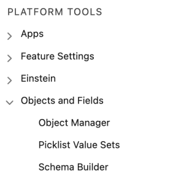
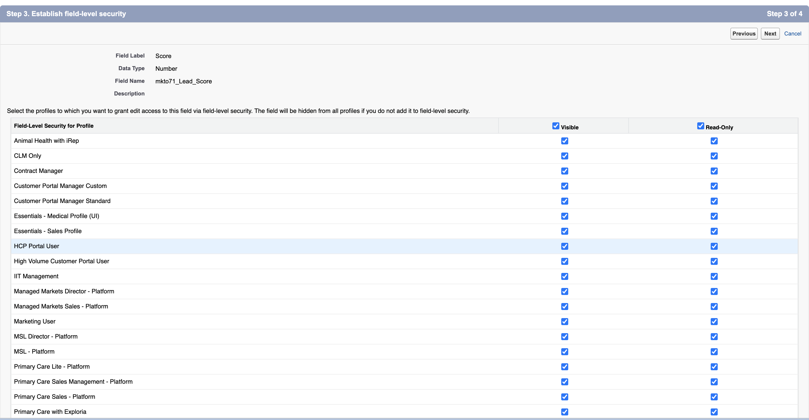

# Passaggio 1 di 3: aggiunta di campi Marketo al CRM [!DNL Veeva] {#step-1-of-3-add-marketo-fields-to-veeva-crm}

>[!PREREQUISITES]
>
>L&#39;istanza di CRM [!DNL Veeva] deve avere accesso alle API di Salesforce per sincronizzare i dati tra Marketo Engage e il CRM [!DNL Veeva].

Marketo Engage utilizza un set di campi per acquisire determinati tipi di informazioni di marketing. Se desideri questi dati in [!DNL Veeva] CRM, segui le istruzioni riportate di seguito.

`1.` Crea un campo personalizzato nel CRM [!DNL Veeva] sugli oggetti contatto: Punteggio

`2.` Se necessario, puoi creare campi aggiuntivi (vedi la tabella seguente).

Tutti questi campi personalizzati sono facoltativi e non sono necessari per sincronizzare Marketo Engage e [!DNL Veeva] CRM.

## Aggiungi campi Marketo a [!DNL Veeva] CRM {#add-marketo-fields-to-veeva-crm}

Aggiungere un campo personalizzato agli oggetti lead e contatto nel CRM [!DNL Veeva] elencati sopra. Per aggiungerne altri, vedere la tabella dei campi disponibili alla fine di questa sezione.

Per aggiungerlo, effettua le seguenti operazioni per il campo Punteggio.

1. Accedere al CRM [!DNL Veeva] e fare clic su **[!UICONTROL Setup]**.

   

1. Fare clic su **[!UICONTROL Objects and Fields]** e selezionare **[!UICONTROL Object Manager]**.

   

1. Nella barra di ricerca, cerca &quot;Contatto&quot;.

   

1. Fare clic sull&#39;oggetto **[!UICONTROL Contact]**.

1. Seleziona **[!UICONTROL Fields and Relationships]**.

1. Fai clic su **[!UICONTROL New]**.

   

1. Scegliere il tipo di campo appropriato (per Punteggio - Numero).

   

1. Fai clic su **[!UICONTROL Next]**.

   

1. Immettere **[!UICONTROL Field Label]**, **[!UICONTROL Length]** e **[!UICONTROL Field Name]** per il campo, come illustrato nella tabella seguente.

<table>
 <tbody>
  <tr>
   <th>Etichetta campo
   <th>Nome campo
   <th>Tipo di dati
   <th>Attributi del campo
  </tr>
  <tr>
   <td>Punteggio</td>
   <td>mkto71_Lead_Score</td>
   <td>Numero</td>
   <td>Lunghezza 10 
Cifre decimali 0</td>
  </tr>
 </tbody>
</table>

>[!NOTE]
>
>[!DNL Veeva] CRM aggiunge __c ai nomi di campo quando li utilizza per creare i nomi API.

>[!NOTE]
>
>I campi di testo e numerici richiedono una lunghezza, ma i campi di data e ora non la richiedono. Una descrizione è facoltativa.

1. Fai clic su **[!UICONTROL Next]**.

   

1. Specificare le impostazioni di accesso e fare clic su **[!UICONTROL Next]**.

1. Imposta tutti i ruoli su **[!UICONTROL Visible]** e **[!UICONTROL Read-Only]**.

1. Deselezionare la casella di controllo **[!UICONTROL Read-Only]** per il profilo dell&#39;utente di sincronizzazione:

* Se si dispone di un utente con il profilo di Amministratore di sistema come utente di sincronizzazione, deselezionare la casella di controllo [!UICONTROL Read-Only] per il profilo Amministratore di sistema (come illustrato di seguito).
* Se è stato creato un profilo personalizzato per l&#39;utente di sincronizzazione, deselezionare la casella di controllo [!UICONTROL Read-Only] per il profilo personalizzato.

  

1. Scegliere i layout di pagina da visualizzare nel campo.

1. Fare clic su **[!UICONTROL Save & New]** per tornare indietro e creare ciascuno degli altri due campi personalizzati.

1. Fai clic su **[!UICONTROL Save]** quando hai finito con tutti e tre.

   

>[!NOTE]
>
>Aggiungendo il campo all&#39;oggetto Contact, vengono aggiunte anche all&#39;oggetto Person Account.

FACOLTATIVO: utilizzare la procedura descritta sopra per i campi personalizzati aggiuntivi della tabella seguente.

<table>
 <tbody>
  <tr>
   <th>Etichetta campo
   <th>Nome campo
   <th>Tipo di dati
   <th>Attributi del campo
  </tr>
  <tr>
   <td>Città dedotta</td>
   <td>mkto71_Inferred_City</td>
   <td>Testo</td>
   <td>Lunghezza 255</td>
  </tr>
  <tr>
   <td>Azienda dedotta</td>
   <td>mkto71_Inferred_Company</td>
   <td>Testo</td>
   <td>Lunghezza 255</td>
  </tr>
  <tr>
   <td>Paese dedotto</td>
   <td>mkto71_Inferred_Country</td>
   <td>Testo</td>
   <td>Lunghezza 255</td>
  </tr>
  <tr>
   <td>Area metropolitana dedotta</td>
   <td>mkto71_Inferred_Metropolitan_Area</td>
   <td>Testo</td>
   <td>Lunghezza 255</td>
  </tr>
  <tr>
   <td>Prefisso telefonico dedotto</td>
   <td>mkto71_Inferred_Phone_Area_Code</td>
   <td>Testo</td>
   <td>Lunghezza 255</td>
  </tr>
  <tr>
   <td>Codice postale dedotto</td>
   <td>mkto71_Inferred_Postal_Code</td>
   <td>Testo</td>
   <td>Lunghezza 255</td>
  </tr>
  <tr>
   <td>Area geografica dello stato dedotta</td>
   <td>mkto71_Inferred_State_Region</td>
   <td>Testo</td>
   <td>Lunghezza 255</td>
  </tr>
 </tbody>
</table>

>[!NOTE]
>
>I valori nei campi assegnati automaticamente da Marketo non saranno immediatamente disponibili in [!DNL Veeva] CRM al momento della creazione del nuovo campo. Marketo sincronizzerà i dati con il CRM [!DNL Veeva] al prossimo aggiornamento del record in uno dei due sistemi (ovvero un aggiornamento di uno qualsiasi dei campi sincronizzati tra Marketo e il CRM [!DNL Veeva]).
