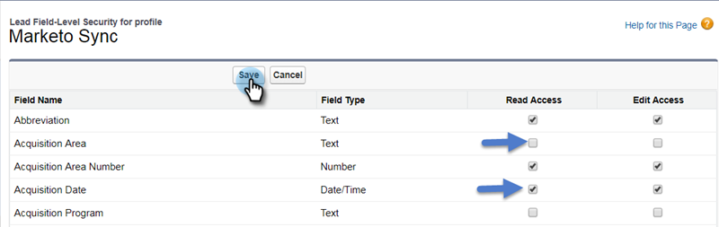

# Passaggio 2 di 3: Creare un utente CRM Veeva per Marketo Engage {#step-2-of-3-create-a-veeva-crm-user-for-marketo-engage}

>[!NOTE]
>
>I passaggi di questo articolo devono essere completati da un amministratore CRM Veeva.

>[!PREREQUISITES]
>
>[Passaggio 1 di 3: Aggiungi campi Marketo a Salesforce (Professional)](/help/marketo/product-docs/crm-sync/veeva-crm-sync/setup/step-1-of-3-add-marketo-fields-to-veeva-crm.md){target=&quot;_blank&quot;}

In questo articolo, personalizzerai le autorizzazioni del campo con un layout di pagina CRM Veeva e creerai un utente di sincronizzazione CRM Marketo-Veeva.

## Imposta layout di pagina {#set-page-layouts}

Seguendo questi passaggi l’utente della sincronizzazione Marketo potrà aggiornare i campi personalizzati.

1. Fare clic sui layout di pagina Account (Account Persona) nella barra di ricerca della barra di navigazione senza premere Invio, quindi fare clic su Layout di pagina sotto Contatti.

   

1. Fai clic su **Layout di pagina**.

   

1. Fai clic su **HCP - Professional**.

   

1. Fai clic e trascina un nuovo **Sezione** nel layout di pagina.

1. Inserisci &quot;Marketo&quot; per Nome sezione e fai clic su **OK**.

   

1. Fai clic e trascina il campo Punteggio nella sezione Marketo .

   

1. Ripeti il passaggio precedente per i campi seguenti:

   * Città in oggetto
   * Azienda in oggetto
   * Paese in oggetto
   * oArea metropolitana in oggetto
   * Prefisso telefonico in oggetto
   * Codice postale in oggetto
   * Stato in oggetto

   >[!NOTE]
   >
   >Questi campi devono trovarsi nel layout di pagina in modo che Marketo possa leggerli o scriverli.

   >[!TIP]
   >
   >Crea due colonne per i campi trascinando verso il basso sul lato destro della pagina. È possibile spostare i campi da un lato all’altro per bilanciare le lunghezze delle colonne.

1. Quando hai finito con il layout HCP-Professional, fai clic su **Salva**.

   

>[!NOTE]
>
>Ripeti questa operazione per altri layout della pagina Account.

## Creare un profilo {#create-a-profile}

1. Fai clic su **Configurazione**.

   

1. Digita &quot;profiles&quot; nella barra di ricerca della barra di navigazione e fai clic sul **Profili** link.

   

1. Fai clic su **Nuovo**.

   

1. Seleziona Utente standard, denomina il profilo &quot;Marketo-Salesforce Sync&quot; e fai clic su **Salva**.

   

## Impostare le autorizzazioni del profilo {#set-profile-permissions}

1. Fai clic su **Modifica** per impostare le autorizzazioni di protezione.

   

1. Nella sezione Autorizzazioni amministrative , accertati che l’opzione Abilitato API sia selezionata.

   

   >[!TIP]
   >
   >Controllare la casella Password Never Expires (Password non scaduta).

1. Nella sezione Autorizzazioni generali utente , accertati che l’opzione Modifica eventi e Modifica attività sia selezionata.

   

1. Nella sezione Autorizzazioni oggetto standard verificare che le autorizzazioni di lettura, creazione, modifica ed eliminazione siano selezionate per la ricerca di account e contatti.

   

1. Nella sezione Autorizzazioni oggetti personalizzati , assicurati che le autorizzazioni di lettura siano selezionate per Chiamata, Messaggio chiave di chiamata e qualsiasi altro oggetto personalizzato desiderato.

   

1. Al termine, fai clic su **Salva** nella parte inferiore della pagina.

   

## Impostare le autorizzazioni del campo {#set-field-permissions}

1. Parla con i tuoi esperti di marketing per scoprire quali campi personalizzati sono necessari per la sincronizzazione.

>[!NOTE]
>
>Questo passaggio impedisce la visualizzazione dei campi non necessari in Marketo, riducendo il disordine e velocizzando la sincronizzazione.

1. Nella pagina dei dettagli del profilo, vai alla sezione Sicurezza a livello di campo . Fare clic su Visualizza per modificare l&#39;accessibilità degli oggetti Contatto e Account.

   

>[!TIP]
>
>Puoi configurare altri oggetti in base alle esigenze della tua organizzazione.

1. Per ciascun oggetto, fai clic su **Modifica**.

   

Individuare i campi non necessari, assicurarsi che Accesso in lettura e Accesso alle modifiche siano **un** controllati. Fai clic su **Salva** al termine.

>[!NOTE]
>
>Modifica l’accessibilità solo per i campi personalizzati.

1. Dopo aver disabilitato tutti i campi non necessari, selezionare Accesso in lettura e Accesso alle modifiche per i campi oggetto seguenti. Al termine, fai clic su Salva .

<table>
 <tbody>
  <tr>
   <th>Oggetto
   <th>Campi
  </tr>
  <tr>
   <td>Account</td>
   <td>Campo Tipo</td>
  </tr>
  <tr>
   <td>Evento</td>
   <td>Tutti i campi</td>
  </tr>
  <tr>
   <td>Attività</td>
   <td>Tutti i campi</td>
  </tr>
 </tbody>
</table>

## Crea utente di sincronizzazione {#create-sync-user}

Marketo richiede le credenziali per accedere a Veeva CRM. È meglio eseguire questa operazione con un utente dedicato creato con i passaggi seguenti.

>[!NOTE]
>
>Se la tua organizzazione non dispone di licenze Veeva CRM aggiuntive, puoi utilizzare un utente Marketing esistente con il profilo amministratore di sistema.

1. Inserisci &quot;utenti&quot; nella barra di ricerca della barra di navigazione e fai clic su **Utenti** in Gestione utenti.

   

1. Fai clic su **Nuovo utente**.

   

1. Compila i campi richiesti, seleziona Licenza utente: Salesforce, imposta il profilo: Marketo Sync User e fai clic su **Salva**.

   

>[!TIP]
>
>Assicurati che l&#39;indirizzo e-mail immesso sia valido. Per reimpostare la password dovrai accedere come utente di sincronizzazione.

Eccellente! Ora hai un account che il Marketo Engage può utilizzare per connettersi a Veeva CRM. Facciamolo.

>[!MORELIKETHIS]
>
>[Passaggio 3 di 3: Connettere Marketo e Veeva CRM](/help/marketo/product-docs/crm-sync/veeva-crm-sync/setup/step-3-of-3-connect-marketo-engage-and-veeva-crm.md){target=&quot;_blank&quot;}
