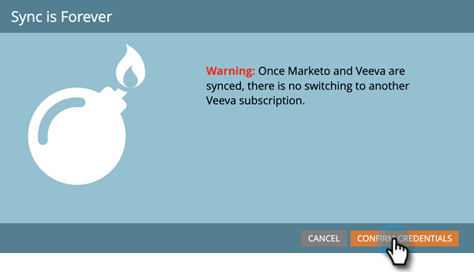

# Passaggio 3 di 3: Connetti il Marketo Engage e Veeva CRM {#step-3-of-3-connect-marketo-engage-and-veeva-crm}

In questo articolo, configurerai il Marketo Engage per la sincronizzazione con la tua istanza di gestione delle relazioni con i clienti Veeva configurata. **Vedrete Salesforce in alcuni pop-up** come Veeva CRM è costruito sulla piattaforma Salesforce.

>[!PREREQUISITES]
>
>* [Passaggio 1 di 3: Aggiungere campi Marketo a Veeva](/help/marketo/product-docs/crm-sync/veeva-crm-sync/setup/step-1-of-3-add-marketo-fields-to-veeva-crm.md){target=&quot;_blank&quot;}
>* [Passaggio 2 di 3: Creare un utente Veeva per Marketo](/help/marketo/product-docs/crm-sync/veeva-crm-sync/setup/step-2-of-3-create-a-veeva-crm-user-for-marketo-engage.md){target=&quot;_blank&quot;}

>[!IMPORTANT]
>
>È possibile collegare una sola istanza di Marketo a un&#39;istanza CRM di Veeva alla volta.

## Connettersi a Veeva CRM utilizzando OAuth {#connect-to-veeva-crm-using-oauth}

1. In Marketo, Fai Clic Su **Amministratore**. Seleziona **CRM** e fai clic su **Sincronizzazione con Veeva**.

   

   >[!NOTE]
   >
   >Assicurati di [nascondere tutti i campi non necessari](/help/marketo/product-docs/crm-sync/salesforce-sync/sfdc-sync-details/hide-a-salesforce-field-from-the-marketo-sync.md){target=&quot;_blank&quot;} in Marketo dall&#39;utente di sincronizzazione prima di fare clic su Campi di sincronizzazione. Una volta fatto clic su Campi di sincronizzazione, tutti i campi che l’utente può visualizzare verranno creati in Marketo in modo permanente e non possono essere eliminati.

1. Fai clic su **Accedi con Veeva**.

   

   >[!NOTE]
   >
   >Seleziona Sandbox se stai sincronizzando una Sandbox Marketo con una Sandbox di Veeva CRM.

1. Fai clic su **Conferma credenziali**.

   

1. Verrà visualizzato un pop-up con la pagina di accesso Salesforce. Immetti le credenziali &quot;Marketo Sync User&quot; e fai clic su **Accesso**.

   

1. Immetti il codice di verifica ricevuto tramite e-mail (inviato da Salesforce) e fai clic su **Verifica**.

   

1. Dopo la verifica, viene visualizzata la pagina di accesso che richiede l’accesso. Fai clic su **Consenti**.

   

1. In pochi minuti verrà visualizzato un pop-up in Marketo Engae. Fai clic su **Conferma credenziali**.

   

## Avvia la sincronizzazione di Veeva {#start-veeva-sync}

1. Fai clic su **Avvia la sincronizzazione di Veeva** per avviare la sincronizzazione CRM permanente Marketo-Veeva.

   

   >[!CAUTION]
   >
   >Marketo non eseguirà automaticamente la deduplicazione rispetto a una sincronizzazione CRM Veeva o quando immetti manualmente i lead.

1. Fai clic su **Avvia sincronizzazione**.

   

>[!NOTE]
>
>Il tempo necessario per completare la sincronizzazione iniziale varia a seconda delle dimensioni e della complessità del database.

## Verifica sincronizzazione {#verify-sync}

Marketo fornisce messaggi di stato per la sincronizzazione CRM Veeva nell’area Amministratore. Per verificare che la sincronizzazione funzioni correttamente, segui questi passaggi.

1. In Marketo, fai clic su **Amministratore**, quindi **Veeva**.

   

1. Lo stato di sincronizzazione è visibile nell’angolo in alto a destra. Verrà visualizzato uno dei tre messaggi seguenti: Ultima sincronizzazione, Sincronizzazione in corso o Non riuscita.

>[!MORELIKETHIS]
>
>[Configurare oggetti personalizzati](/help/marketo/product-docs/crm-sync/veeva-crm-sync/sync-details/custom-object-sync.md){target=&quot;_blank&quot;}
