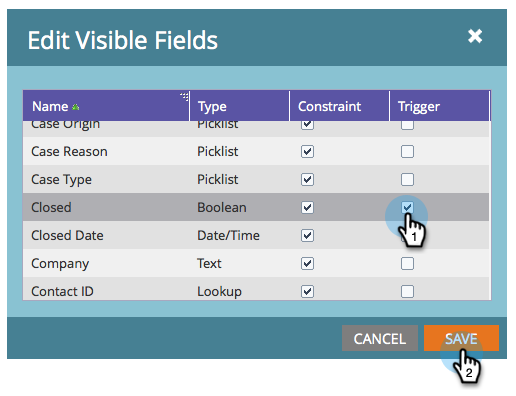

# Aggiungi/rimuovi campo di oggetto personalizzato come vincoli di elenco avanzato/trigger {#add-remove-custom-object-field-as-smart-list-trigger-constraints}

Il Marketo Engage fornisce un controllo specifico sulla sincronizzazione di oggetti personalizzati Veeva. Questo consente di selezionare i campi disponibili come vincoli nei filtri di oggetti personalizzati e di utilizzarli come attivatori nelle campagne avanzate.

>[!NOTE]
>
>**Autorizzazioni amministratore richieste**

1. Fai clic su **Amministratore**, quindi **Sincronizzazione oggetti Veeva**.

   

1. Selezionare l&#39;oggetto da modificare.

   

1. Fai clic su **Modifica campi visibili**.

   

   >[!TIP]
   >
   >Se il pulsante Modifica campi visibili è disattivato, l’oggetto è attualmente utilizzato in un elenco avanzato o in una campagna avanzata. Rimuovere tutte le associazioni per continuare.

1. Se la sincronizzazione globale è abilitata, fai clic su **Disattiva sincronizzazione globale**.

   

1. Seleziona le caselle accanto ai vincoli di filtro/trigger desiderati e fai clic su **Salva**.

   

   >[!NOTE]
   >
   >Per impostazione predefinita, tutti i campi sono selezionati come vincoli per i filtri.

1. Fai clic sulla scheda Campi per confermare le modifiche.

   

>[!IMPORTANT]
>
>Non dimenticare di riabilitare la sincronizzazione globale.

Ora le tue smart list e campagne intelligenti hanno ancora più potenza.

>[!MORELIKETHIS]
>
>[Attiva/Disattiva la sincronizzazione personalizzata degli oggetti](/help/marketo/product-docs/crm-sync/veeva-crm-sync/sync-details/enable-disable-custom-object-sync.md){target=&quot;_blank&quot;}
