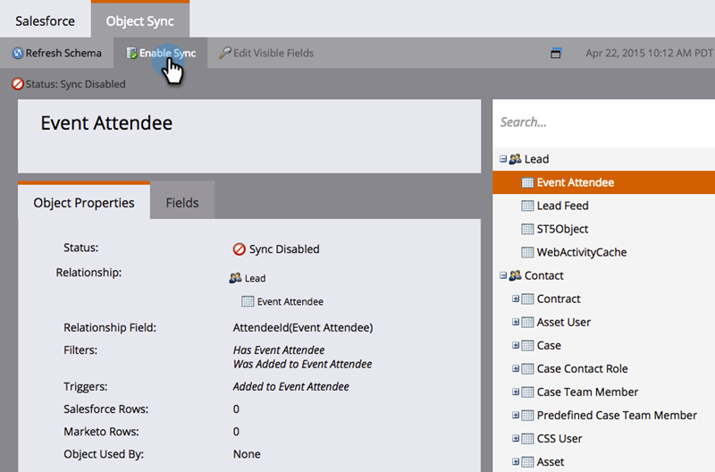

# Sincronizzazione oggetti personalizzata {#custom-object-sync}

Anche gli oggetti personalizzati creati nella tua istanza CRM di Veeva possono far parte del Marketo Engage. Ecco come configurarlo.

>[!NOTE]
>
>**Autorizzazioni amministratore richieste**

>[!PREREQUISITES]
>
>Per utilizzare un oggetto personalizzato, deve essere associato a un contatto o a un oggetto account in Veeva CRM.

## Abilita oggetto personalizzato {#enable-custom-object}

1. In Marketo, fai clic su **Amministratore**, quindi **Sincronizzazione oggetti Veeva**.

   

1. Se si tratta del primo oggetto personalizzato, fare clic su **Schema di sincronizzazione**.

   

1. Fai clic su **Disattiva sincronizzazione globale**.

   

   >[!NOTE]
   >
   >La sincronizzazione iniziale dello schema di oggetti personalizzati Veeva potrebbe richiedere alcuni minuti.

1. Trascina l’oggetto personalizzato da sincronizzare nell’area di lavoro.

   

   >[!NOTE]
   >
   >Gli oggetti personalizzati devono avere nomi univoci. Marketo non supporta due oggetti personalizzati diversi con lo stesso nome.

1. Fai clic su **Abilita sincronizzazione**.

   

1. Fai clic su **Abilita sincronizzazione** di nuovo.

   

1. Torna alla pagina **Veeva** scheda .

   

1. Fai clic su **Abilita sincronizzazione**.

   

1. Per visualizzare tutti gli oggetti personalizzati Veeva, fare clic su Sincronizzazione oggetti amministrazione e veeva.

   

   >[!NOTE]
   >
   >Marketo supporta solo le entità personalizzate collegate a entità standard con profondità compresa tra uno e due livelli.

Eccellente! È ora possibile utilizzare i dati di questo oggetto personalizzato in Smart Campaigns ed Elenchi avanzati.

>[!MORELIKETHIS]
>
>* [Sincronizzazione dei messaggi chiave di chiamata e chiamata](/help/marketo/product-docs/crm-sync/veeva-crm-sync/sync-details/syncing-call-and-call-key-messages.md){target=&quot;_blank&quot;}
>* [Aggiungi/rimuovi campo di oggetto personalizzato come vincoli di elenco avanzato/trigger](/help/marketo/product-docs/crm-sync/veeva-crm-sync/sync-details/add-remove-custom-object-field-as-smart-list-trigger-constraints.md){target=&quot;_blank&quot;}

