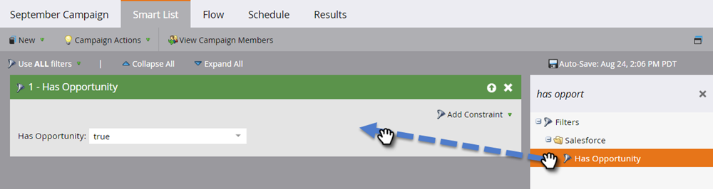

# Abilita/Disabilita sincronizzazione oggetti personalizzati {#enable-disable-custom-object-sync}

Anche gli oggetti personalizzati creati nell’istanza di CRM Veeva possono far parte del Marketo Engage. Ecco come configurarlo.

## Attivare o disattivare la sincronizzazione oggetti personalizzati {#enable-or-disable-the-custom-object-sync}

>[!NOTE]
>
>**Autorizzazioni amministratore richieste**

1. In Marketo, fai clic su **Amministratore**, quindi **Sincronizzazione oggetti Veeva**.

   

1. Se si tratta del primo oggetto personalizzato, fare clic su Sincronizza schema. In caso contrario, fare clic su **Aggiorna schema** per avere la versione più recente.

   

1. Se la sincronizzazione globale è in esecuzione, disattivarla facendo clic su **Disattiva sincronizzazione globale**.

   

   >[!NOTE]
   >
   >La sincronizzazione dello schema di oggetti personalizzato Veeva potrebbe richiedere alcuni minuti.

1. Clic **Aggiorna schema**.

   

Selezionare l&#39;oggetto da sincronizzare e fare clic su Abilita sincronizzazione.

>[!TIP]
>
>Marketo può sincronizzare un oggetto personalizzato solo se ha una relazione diretta con l&#39;oggetto Contatto o Account in Veeva CRM.

1. Clic **Abilita sincronizzazione** di nuovo.

   

1. Torna alla scheda Veeva e fai clic su **Abilita sincronizzazione**.

   

## Utilizzo degli oggetti personalizzati {#using-your-custom-objects}

>[!NOTE]
>
>Non è possibile utilizzare oggetti personalizzati nelle campagne intelligenti con trigger.

1. Nell’elenco avanzato, trascina il filtro &quot;Ha opportunità&quot; e imposta su **Vero**.

   

1. Facoltativamente, utilizza i vincoli di filtro per restringere lo stato attivo.

   

Eccellente! Ora puoi utilizzare i dati di questo oggetto personalizzato in Campagne avanzate ed Elenchi avanzati.

>[!MORELIKETHIS]
>
>[Aggiungi/Rimuovi campo oggetto personalizzato come vincoli di elenco avanzato/trigger](/help/marketo/product-docs/crm-sync/veeva-crm-sync/sync-details/add-remove-custom-object-field-as-smart-list-trigger-constraints.md){target="_blank"}
