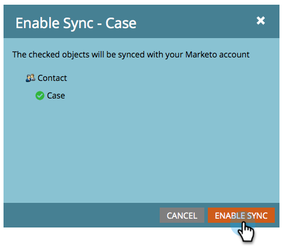

# Abilitare/disabilitare la sincronizzazione oggetti personalizzati {#enable-disable-custom-object-sync}

Anche gli oggetti personalizzati creati nell&#39;istanza di CRM [!DNL Veeva] possono far parte di Marketo Engage. Ecco come configurarlo.

## Attivare o disattivare la sincronizzazione oggetti personalizzati {#enable-or-disable-the-custom-object-sync}

>[!NOTE]
>
>**Autorizzazioni amministratore richieste**

1. In Marketo, fai clic su **[!UICONTROL Admin]**, quindi su **[!UICONTROL Veeva Objects Sync]**.

   

1. Se si tratta del primo oggetto personalizzato, fare clic su **[!UICONTROL Sync Schema]**. In caso contrario, fare clic su **[!UICONTROL Refresh Schema]** per verificare di disporre dell&#39;ultima versione.

   

1. Se la sincronizzazione globale è in esecuzione, disabilitarla facendo clic su **[!UICONTROL Disable Global Sync]**.

   

   >[!NOTE]
   >
   >La sincronizzazione dello schema di oggetti personalizzato [!DNL Veeva] potrebbe richiedere alcuni minuti.

1. Fai clic su **[!UICONTROL Refresh Schema]**.

   

Selezionare l&#39;oggetto da sincronizzare e fare clic su **[!UICONTROL Enable Sync]**.

>[!TIP]
>
>Marketo può sincronizzare un oggetto personalizzato solo se ha una relazione diretta con l&#39;oggetto Contatto o Account in [!DNL Veeva] CRM.

1. Fare di nuovo clic su **[!UICONTROL Enable Sync]**.

   

1. Tornare alla scheda [!UICONTROL Veeva] e fare clic su **[!UICONTROL Enable Sync]**.

   

## Utilizzo degli oggetti personalizzati {#using-your-custom-objects}

>[!NOTE]
>
>Non è possibile utilizzare oggetti personalizzati nelle campagne intelligenti con trigger.

1. In [!UICONTROL Smart List], trascina il filtro &quot;**[!UICONTROL Has Opportunity]**&quot; e imposta su **[!UICONTROL True]**.

   

1. Facoltativamente, utilizza i vincoli di filtro per restringere lo stato attivo.

   

Eccellente! È ora possibile utilizzare i dati di questo oggetto personalizzato in [!UICONTROL Smart Campaigns] e [!UICONTROL Smart Lists].

>[!MORELIKETHIS]
>
>[Aggiungi/Rimuovi campo oggetto personalizzato come elenco avanzato/vincoli trigger](/help/marketo/product-docs/crm-sync/veeva-crm-sync/sync-details/add-remove-custom-object-field-as-smart-list-trigger-constraints.md){target="_blank"}
