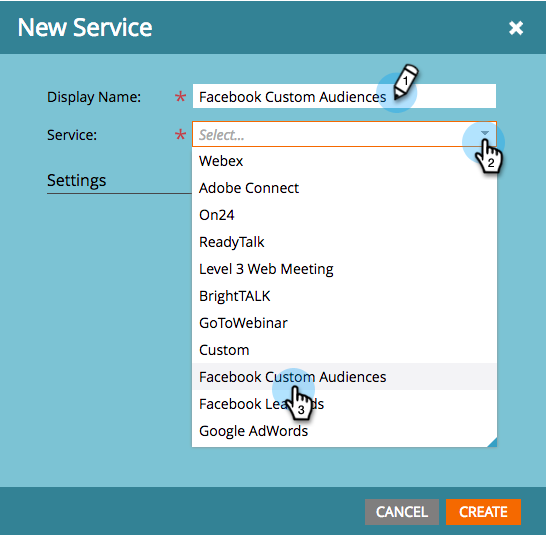
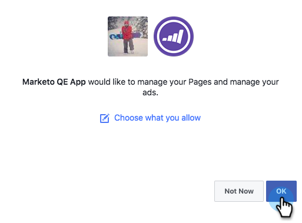

# Aggiungi [!DNL Facebook] tipi di pubblico personalizzati come servizio [!DNL LaunchPoint] {#add-facebook-custom-audiences-as-a-launchpoint-service}

>[!NOTE]
>
>**Autorizzazioni amministratore richieste**

Con questa integrazione è possibile inviare dati di pubblico da elenchi statici e avanzati di Marketo a [!DNL Facebook] per utilizzarli come tipi di pubblico personalizzati nelle campagne pubblicitarie [!DNL Facebook]. Segui questi passaggi per configurarlo.

1. Passare a Marketo **[!UICONTROL Admin]**.

   

1. Vai a **[!UICONTROL LaunchPoint]**, fai clic su **[!UICONTROL New]** e seleziona **[!UICONTROL New Service]**.

   

1. Immetti **[!UICONTROL Display Name]** per il servizio e seleziona il servizio **[!UICONTROL Facebook Custom Audiences]** dal menu a discesa **[!UICONTROL Service]**.

   

1. Apri una nuova scheda nello stesso browser e passa a [facebook.com](https://www.facebook.com/). Accedere a [!DNL Facebook] utilizzando l&#39;account che si desidera utilizzare per l&#39;integrazione.

   >[!CAUTION]
   >
   >Affinché Marketo possa inviare tipi di pubblico su più account di Ad Manager, l&#39;utente [!DNL Facebook] autorizzato nei passaggi seguenti deve avere accesso a *tutti* gli account.

   

1. Dopo aver effettuato l&#39;accesso a [!DNL Facebook], tornare a Marketo. Fai clic su **[!UICONTROL Authorize]**.

   

   >[!NOTE]
   >
   >*devi* utilizzare un account di [!DNL Facebook] Business Manager per il corretto funzionamento dell&#39;integrazione dei tipi di pubblico personalizzati. Per informazioni sulla configurazione di un account di Business Manager, consultare la [[!DNL Facebook] Guida](https://www.facebook.com/business/help/1710077379203657).

1. Se richiesto, fare clic su **[!UICONTROL OK]** per accettare l&#39;installazione dell&#39;app Marketo in [!DNL Facebook].

   

1. Ora sei autorizzato. Selezionare una modalità corrispondente e fare clic su **[!UICONTROL Create]**.

   >[!NOTE]
   >
   >**[!UICONTROL Basic Matching]** utilizza solo indirizzi e-mail. **[!UICONTROL Advanced Matching]** utilizza sette campi aggiuntivi, che aumentano il tasso di corrispondenza, per una maggiore conversione. Tuttavia, se l&#39;informativa sulla privacy della tua azienda non consente la condivisione di campi aggiuntivi o se i tuoi dati non li includono, seleziona [!UICONTROL Basic Matching].

   

   Ora puoi passare a qualsiasi elenco statico o avanzato in Marketo e inviare dati sul pubblico a [!DNL Facebook].

   >[!CAUTION]
   >
   >Prima di utilizzare la tua integrazione, [Accetta i termini dei tipi di pubblico personalizzati di  [!DNL Facebook]](https://www.facebook.com/ads/manage/customaudiences/tos.php) nel tuo account [!DNL Facebook]. In caso contrario, gli aggiornamenti del pubblico non riusciranno.

>[!MORELIKETHIS]
>
>* [Crea un pubblico personalizzato in [!DNL Facebook]](/help/marketo/product-docs/demand-generation/facebook/create-a-custom-audience-in-facebook.md)
>
>* [Configura [!DNL Facebook] Annunci lead](/help/marketo/product-docs/demand-generation/facebook/set-up-facebook-lead-ads.md)
