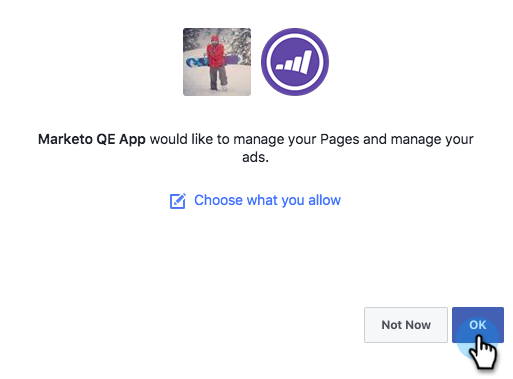

# Aggiungere tipi di pubblico personalizzati di Facebook come servizio LaunchPoint {#add-facebook-custom-audiences-as-a-launchpoint-service}

>[!NOTE]
>
>**Autorizzazioni amministratore richieste**

Con questa integrazione è possibile inviare dati di pubblico da elenchi statici e avanzati di Marketo Engage a Facebook per utilizzarli come tipi di pubblico personalizzati nelle campagne Facebook Ad. Ecco come configurarlo.

1. Vai a Marketo **[!UICONTROL Amministratore]**.

   

1. Vai a **[!UICONTROL LaunchPoint]**, fai clic su **[!UICONTROL Nuovo]** e seleziona **[!UICONTROL Nuovo servizio]**.

   

1. Immetti un **[!UICONTROL Nome visualizzato]** per il servizio e seleziona il servizio **[!UICONTROL Tipi di pubblico personalizzati di Facebook]** dal menu a discesa **[!UICONTROL Servizio]**.

   

1. Apri una nuova scheda nello stesso browser e passa a [facebook.com](https://www.facebook.com/){target="_blank"}. Accedi a Facebook utilizzando l’account che desideri utilizzare per l’integrazione.

   >[!CAUTION]
   >
   >Affinché Marketo possa inviare tipi di pubblico su più account di Ad Manager, l&#39;utente Facebook che autorizzi nei passaggi seguenti deve avere accesso a *tutti* di questi account.

   

1. Dopo aver effettuato l’accesso a Facebook, torna a Marketo. Fare clic su **[!UICONTROL Autorizza]**.

   

   >[!NOTE]
   >
   >_devi_ utilizzare un account Facebook Business Manager per il corretto funzionamento dell&#39;integrazione dei tipi di pubblico personalizzati. Per informazioni su come configurare un account di Business Manager, consultare la [Guida di Facebook](https://www.facebook.com/business/help/1710077379203657){target="_blank"}.

1. Se richiesto, fare clic su **[!UICONTROL OK]** per accettare l&#39;installazione dell&#39;app Marketo in Facebook.

   

1. Ora sei autorizzato! Selezionare una modalità corrispondente e fare clic su **[!UICONTROL Crea]**.

   >[!NOTE]
   >
   >**Corrispondenza di base** utilizza solo indirizzi di posta elettronica. **Corrispondenza avanzata** utilizza sette campi aggiuntivi, che aumentano il tasso di corrispondenza, per una maggiore conversione. Tuttavia, se l’informativa sulla privacy della tua azienda non consente la condivisione di campi aggiuntivi o se i tuoi dati non li includono, seleziona Corrispondenza di base.

   

   Ottimo lavoro! Ora puoi passare a qualsiasi elenco statico o avanzato in Marketo e inviare i dati sul pubblico a Facebook.

   >[!CAUTION]
   >
   >Oh, prima di andare, assicurati di [accettare i termini dei tipi di pubblico personalizzati di Facebook](https://www.facebook.com/ads/manage/customaudiences/tos.php){target="_blank"} nel tuo account Facebook. In caso contrario, gli aggiornamenti del pubblico non riusciranno.

>[!MORELIKETHIS]
>
>* [Creazione di un pubblico personalizzato in Facebook](/help/marketo/product-docs/demand-generation/facebook/create-a-custom-audience-in-facebook.md){target="_blank"}
>
>* [Configurazione annunci lead Facebook](/help/marketo/product-docs/demand-generation/facebook/set-up-facebook-lead-ads.md){target="_blank"}
