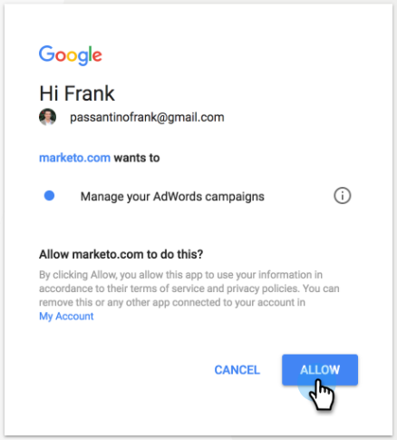
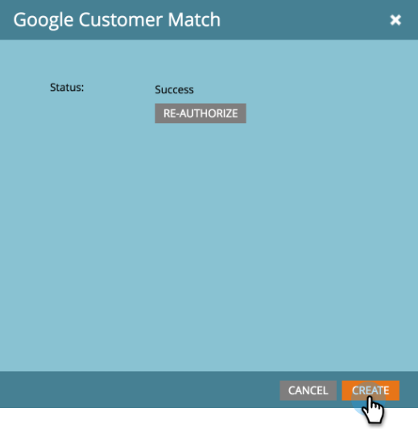

# Aggiungi Customer Match Google come servizio [!DNL LaunchPoint] {#add-google-customer-match-as-a-launchpoint-service}

Con questa integrazione, puoi inviare un pubblico Marketo a Google per il targeting utilizzando [!DNL Google AdWords], nonché rieseguire il targeting dei tipi di pubblico in YouTube, Search e [!DNL Gmail].

>[!NOTE]
>
>**Autorizzazioni amministratore richieste**

1. Passa a **[!UICONTROL Admin]**.

   

1. Fai clic su **[!UICONTROL LaunchPoint]**.

   

1. Selezionare **[!UICONTROL New]** e quindi **[!UICONTROL New Service]**.

   

1. Immettere **[!UICONTROL Display Name]** e selezionare **[!UICONTROL Google Customer Match]** dal menu a discesa **[!UICONTROL Service]**. Fai clic su **[!UICONTROL Create]**.

   

1. Per connettere un account [!DNL Google AdWords], fare clic su **[!UICONTROL Authorize]**.

   

1. Google si apre in una nuova scheda. Da qui, accedi al tuo account [!DNL Google AdWords].

   >[!CAUTION]
   >
   >Affinché Marketo possa inviare tipi di pubblico su più account [!DNL AdWords], l&#39;utente di Google autorizzato nei passaggi seguenti deve avere accesso a _tutti_ di questi account.

   

1. Rivedere le autorizzazioni richieste, quindi fare clic su **[!UICONTROL Allow]**.

   

1. L&#39;account [!DNL Google AdWords] è ora connesso a Marketo. Fai clic su **[!UICONTROL Create]**.

   

   Fantastico! Ora nella scheda Servizi installati sono elencati i tipi di pubblico corrispondenti a Google come servizio [!DNL LaunchPoint].

>[!NOTE]
>
>L’integrazione Customer Match di Google può supportare un solo account manager e tutti gli account secondari all’interno di tale account manager. Non sono supportati più account manager.
