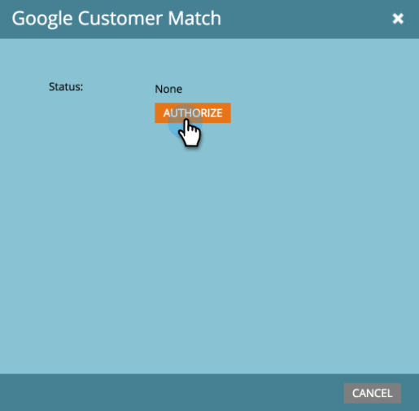

# Aggiungere Google Customer Match come servizio LaunchPoint {#add-google-customer-match-as-a-launchpoint-service}

Con questa integrazione, puoi inviare un pubblico di Marketo Engage a Google per il targeting utilizzando Google AdWords, nonché per il re-targeting dei tipi di pubblico in YouTube, Search e Gmail.

>[!NOTE]
>
>**Autorizzazioni amministratore richieste**

1. Vai a **[!UICONTROL Amministratore]**.

   

1. Fare clic su **[!UICONTROL LaunchPoint]**.

   

1. Selezionare **[!UICONTROL Nuovo]** e quindi **[!UICONTROL Nuovo servizio]**.

   

1. Immetti un **[!UICONTROL Nome visualizzato]** e seleziona **[!UICONTROL Google Customer Match]** dal menu a discesa **[!UICONTROL Service]**. Fai clic su **[!UICONTROL Crea]**.

   

1. Per connettere un account Google AdWords, fare clic su **[!UICONTROL Autorizza]**.

   

1. Google si apre in una nuova scheda. Da qui, accedi al tuo account Google AdWords.

   >[!CAUTION]
   >
   >Affinché Marketo possa inviare tipi di pubblico su più account AdWords, l&#39;utente di Google autorizzato nei passaggi seguenti deve avere accesso a _tutti_ di questi account.

   

1. Rivedi le autorizzazioni richieste, quindi fai clic su **[!UICONTROL Consenti]**.

   

1. Il tuo account Google AdWords è ora connesso a Marketo. Fai clic su **[!UICONTROL Crea]**.

   

   Fantastico! Ora i tipi di pubblico corrispondenti a Google sono elencati come servizio LaunchPoint nella scheda Servizi installati.

>[!NOTE]
>
>L’integrazione Customer Match di Google può supportare un solo account manager e tutti gli account secondari all’interno di tale account manager. Non sono supportati più account manager.
