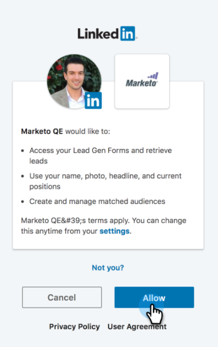

# Aggiungere tipi di pubblico LinkedIn corrispondenti come servizio LaunchPoint {#add-linkedin-matched-audiences-as-a-launchpoint-service}

>[!NOTE]
>
>**Autorizzazioni amministratore richieste**

Connetti il tuo account Marketo con LinkedIn Matched Audiences per utilizzare un elenco statico di Marketo o un elenco avanzato come segmento di pubblico di LinkedIn.

1. Vai a **Amministratore** sezione.

   

1. Seleziona **Launchpoint**.

   

1. Seleziona **Nuovo** e **Nuovo servizio**.

   

1. Immetti un **Nome visualizzato** e scegli **Tipi di pubblico di linkedIn corrispondenti**. Fai clic su **Crea**.

   

1. Per connettere un account LinkedIn, fai clic su **Autorizza**.

   

   >[!CAUTION]
   >
   >Affinché Marketo possa inviare tipi di pubblico su più account LinkedIn Ad, l’utente LinkedIn autorizzato nei passaggi seguenti deve avere accesso a *tutto* di questi account pubblicitari nel rispettivo Campaign Manager.

1. LinkedIn si apre in una nuova scheda. Da qui, accedi al tuo account LinkedIn.

   

1. Rivedi le autorizzazioni richieste, quindi fai clic su **Consenti**.

   

1. Il tuo account LinkedIn è ora connesso a Marketo. Fai clic su **Crea**.

   

   Fantastico! Ora i tipi di pubblico corrispondenti a LinkedIn sono elencati come servizio LaunchPoint nella scheda Servizi installati.

   

>[!MORELIKETHIS]
>
>[Utilizzare un elenco Marketo o un elenco avanzato come segmento di pubblico LinkedIn](/help/marketo/product-docs/demand-generation/social/social-functions/use-a-marketo-list-or-smart-list-as-a-linkedin-audience-segment.md)
