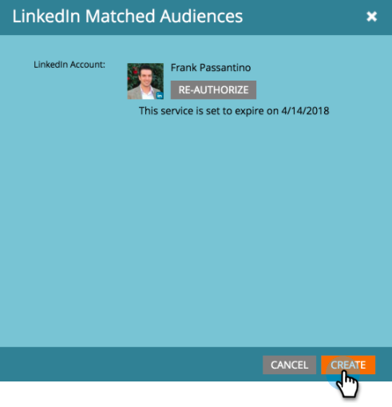

# Aggiungere tipi di pubblico corrispondenti a LinkedIn come servizio LaunchPoint {#add-linkedin-matched-audiences-as-a-launchpoint-service}

>[!NOTE]
>
>**Autorizzazioni amministratore richieste**

Collega il tuo account Marketo con LinkedIn Matched Audiences per utilizzare un elenco statico o un elenco avanzato Marketo come segmento di pubblico di LinkedIn.

1. Vai a **Amministratore** sezione .

   

1. Seleziona **Punto di avvio**.

   

1. Seleziona **Nuovo** e **Nuovo servizio**.

   

1. Inserisci un **Nome visualizzato** e scegli **Tipi di pubblico abbinati a linkedIn**. Fai clic su **Crea**.

   

1. Per collegare un account LinkedIn, fai clic su **Autorizzare**.

   

   >[!CAUTION]
   >
   >Affinché Marketo possa inviare tipi di pubblico tra più account LinkedIn Ad, l’utente LinkedIn autorizzato nei seguenti passaggi deve avere accesso a *tutto* di questi account pubblicitari nel loro Campaign Manager.

1. linkedIn si apre in una nuova scheda. Da qui, accedi al tuo account LinkedIn.

   

1. Esamina le autorizzazioni richieste, quindi fai clic su **Consenti**.

   

1. L&#39;account LinkedIn è ora connesso a Marketo. Fai clic su **Crea**.

   

   Fantastico! Nella scheda Servizi installati è ora disponibile l’elenco Tipi di pubblico corrispondenti per LinkedIn come servizio LaunchPoint .

   

>[!MORELIKETHIS]
>
>[Utilizzare un elenco Marketo o un elenco avanzato come segmento di pubblico di LinkedIn](/help/marketo/product-docs/demand-generation/social/social-functions/use-a-marketo-list-or-smart-list-as-a-linkedin-audience-segment.md)
